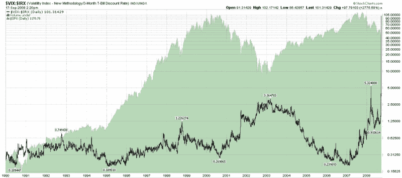

<!--yml

类别：未分类

日期：2024 年 05 月 18 日 18:26:09

-->

# VIX and More：波动性灾难图表

> 来源：[`vixandmore.blogspot.com/2008/09/volatility-catastrophe-graphic.html#0001-01-01`](http://vixandmore.blogspot.com/2008/09/volatility-catastrophe-graphic.html#0001-01-01)

这里"灾难"可能并不是完全正确的词，但我需要一个标题来介绍下面的图形，这是 VIX 与 3 个月期 T-Bill 收益率之比的比率（[VIX:IRX ratio](http://vixandmore.blogspot.com/search/label/VIX%3AIRX)）。

图表追溯到 1990 年 VIX 数据的开始，即使在对数尺度下，也表明当前环境比过去 19 年中的任何一天都更令人担忧（至少从波动性和飞向安全的角度来看）。

要了解更多关于这个特定比率的背景，请查看[扩展关于 VIX 和 10 年期国债收益率的内容](http://vixandmore.blogspot.com/2008/03/expanding-on-vix-and-10-year-treasury.html)和[恐惧和飞向安全](http://vixandmore.blogspot.com/2008/03/fear-and-flight-to-safety.html)。

[来源：StockCharts]
