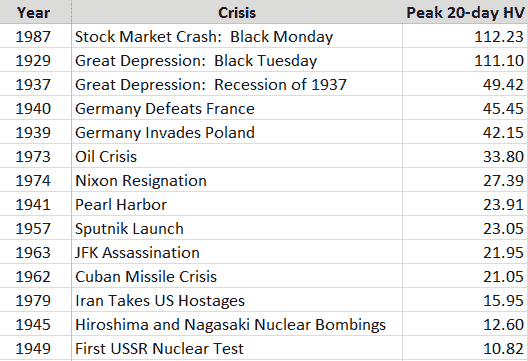
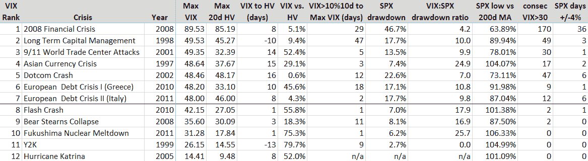

<!--yml

category: 未分类

date: 2024-05-18 16:20:35

-->

# VIX and More: 危机期间的波动性

> 来源：[`vixandmore.blogspot.com/2012/12/volatility-during-crises.html#0001-01-01`](http://vixandmore.blogspot.com/2012/12/volatility-during-crises.html#0001-01-01)

*[以下内容最初出现在[Expiring Monthly: 期权交易者杂志](http://www.expiringmonthly.com/)的 2011 年 8 月版中。我想分享这篇文章，因为它可能有助于一些读者将当前的财政悬崖危机放入历史背景中。]*

*过去三周的事件提醒我们，金融危机和股市波动性几乎可以在一瞬间出现，并在一些投资者甚至来不及问发生了什么之前就失控了。一个例子：8 月 3 日，美国最终达成提高债务上限的协议，投资者们松了一口气；那时，VIX 指数为 23.38，反映了相对的平静，然而仅仅三天后，VIX 指数飙升至 48.00，因为两起新危机取代了债务上限问题。

2011 年，从北非、日本、欧洲到美国，头 8 个月见证了一系列危机。在这种普遍的危机氛围下，投资者们合理地考虑他们在危机期间应该预期多少波动性。在本文中，我将试图将危机和波动性放入一些历史背景中，并探讨影响危机期间波动幅度和持续时间的各种因素，涉及基本、技术和心理原因。

**20 世纪的波动性**

每一代人都喜欢认为他们所面临的问题比之前的一代更具挑战性和更加复杂。毫无疑问，投资者们也会陷入这种思考中。随着高度互联的全球经济、以光速在全球传播的新闻周期，以及高频率和算法交易系统将交易任务从人类转移到机器，对当前一系列问题有很多话要说。然而，仅看 20 世纪上半叶，投资者们必须应对大萧条、两次世界大战和核时代的曙光。

鉴于芝加哥期权交易所波动率指数（VIX）直到 1993 年才推出，对于 VIX 之前的各种危机的波动性部分的评估必须依赖于[历史波动性](http://vixandmore.blogspot.com/search/label/historical%20volatility)（HV）而不是[隐含波动性](http://vixandmore.blogspot.com/search/label/implied%20volatility)。由于 VIX 所基于的标普 500 指数仅追溯到 1957 年，我选择使用追溯到大萧条之前的道琼斯工业平均指数的历史数据。在下面的图表 1 中，我汇集了 1929 年至今的一些危机的峰值 20 天历史波动率读数。

在研究表格之前，读者可能希望通过在脑海中列出构成对美国即时或延迟威胁的 20 世纪事件的简要练习，然后将该威胁的程度与道琼斯工业平均指数的峰值历史波动性进行比较。如果你像大多数历史学家和投资者一样，在查看数据之后，你可能会得出结论，危机的程度与股市波动性的程度之间的相关性最多是非常微弱的。

******

*[来源：Yahoo]*

在这样一个排名中，古巴导弹危机和珍珠港事件排在名单的下半部分，肯定会引起一些人的注意。坦率地说，即使是其中的一件事件没有触发 25 的历史波动率读数，我也会感到惊讶，但看到这种情况发生在名单上的一半危机中，确实提供了相当多的思考材料。

**VIX 时代的波动性**

发行 VIX 后，不仅可以评估历史波动性，还可以评估隐含波动性。在仅有 18 年的数据可供参考的情况下，要研究的危机数量有限。因此，在下面的图表 2 中，我突出显示了 VIX 时代的七次危机，其中日内波动性至少达到 48\. 此外，为了比较，我还包括了其他五次 VIX 波动较小的危机。

*[来源：CBOE，Yahoo]*

*一些简要的解释性注释可能会使数据更容易解释。首先，危机按最大 VIX 值排序，最大历史波动率在相邻的一列中，以便进行简单比较。 MAX HV 数据右侧的列捕获了从峰值 VIX 读数到最大 20 天 HV 读数的天数，负数（LTCM 和 Y2K）表示 HV 在 VIX 之前达到峰值。 VIX vs. HV 列计算了 VIX 峰值超过峰值 HV 的百分比。 VIX>10%10d… 列反映了从首个 VIX 收盘价超过其 10 天移动平均线到峰值 VIX 读数的天数。 SPX Drawdown 列计算了危机期间标准普尔 500 指数的峰值至谷底回撤的最大值，而不是从任何危机前的峰值开始。 VIX:SPX drawdown ratio 计算了从 SPX 危机高点到 SPX 危机低点期间的 VIX 百分比变化与 SPX 相同期间的百分比变化（当然这些不一定是该时期的 VIX 高点和低点）。 SPX 低于 200 天移动平均线的最大值是 SPX 在危机期间低于其 200 天移动平均线的最大值。 最后，最后两列捕获了 VIX 在危机期间收盘至少达到 30 的连续天数以及标准普尔 500 指数在危机期间收盘至少比前一天的收盘价高或低 4%的天数。*

查看 VIX 时代的数字，很容易理解[2008 年的金融危机](http://vixandmore.blogspot.com/search/label/2008)在许多类别中占主导地位并不奇怪。跨越行，我们可以从各种波动率指标中获得每个危机的有趣横截面，但我认为更有趣的分析来自于检查列，我们不仅可以了解危机的性质，还可以了解波动性。一个重要的警告是，有限数量的数据点不允许这是一个统计上有效的样本，但这并不排除得出一些潜在有价值和可行动的结论的可能性。

查看峰值 VIX 读数与峰值 HV 读数的相对关系，我注意到在所有情况下，VIX 最终都高于最大的 20 天历史波动率读数。在五次较小的危机中，VIX 通常比峰值 HV 高 50-80%。在七次主要危机中，毫不奇怪的是，HV 在几个实例中接近 VIX，但在[9/11 袭击](http://vixandmore.blogspot.com/search/label/9%2F11)和 2010 年[欧洲主权债务危机](http://vixandmore.blogspot.com/search/label/European%20sovereign%20debt%20crisis)的情况下，VIX 读数严重高估了未来实现的波动性。

我对第一个 VIX 收盘价超过其 10 日移动平均线与最大 VIX 读数之间时间的假设之一是，初始 VIX 突破与最大 VIX 之间的时间越长，VIX 峰值就越高。在这种情况下，[长期资本管理](http://vixandmore.blogspot.com/search/label/Long%20Term%20Capital%20Management)（LTCM）和 2008 年危机支持了这一假设，但其他地方的数据很零散。当前的欧洲债务危机，[1997 年亚洲货币危机](http://vixandmore.blogspot.com/search/label/Asian%20financial%20crisis)和 9/11 袭击都反映了 VIX 迅速升至危机高点。在 2010 年 5 月的“[闪崩事件](http://vixandmore.blogspot.com/search/label/flash%20crash)”和福岛核危机中，最大的 VIX 读数发生在初始 VIX 突破后的第二天。由于许多交易员使用 VIX 相对于其 10 日移动平均线的水平作为交易触发器，本栏中的数据可能对那些希望优化入场点或更好地理解风险管理方程中的时间因素的人有所帮助。

关于 SPX 的回撤数据，亚洲货币危机显然是一种情况，其中 VIX 飙升似乎与 SPX 峰值到谷底的回撤不成比例。在另一方面，互联网泡沫破裂期间的回撤似乎与更高的 VIX 读数相一致。这里的一个事实是，股票市场花了大约 2 年半的时间才找到底部，这意味着当市场最终触底时，投资者在某种程度上已经对此不太敏感，一些恐惧和恐慌已经离开了市场，这与 2009 年 3 月触底时发生的情况相似。请注意，所有 12 次危机的中位数 VIX：SPX 回撤比率为 10.0，这大约是在更正常的市场条件下所期望的 VIX 波动的 2 ½ 倍。

SPX 低点与 200 日移动平均值的数据类似于 SPX 的回撤数据。在大多数情况下，任何超过 10%的回撤都可能使指数跌破其 200 日移动平均线。在上述七次主要危机中，除了亚洲货币危机外，所有危机都将指数拖入其 200 日移动平均线以下；另一方面，在除一次外的所有次要危机中，SPX 都没有跌破其 200 日移动平均线。至少根据这些数据，人们可能倾向于将 200 日移动平均线的突破作为区分主要危机和次要危机的一个方面。

在我看来，最后两列——VIX 收盘价连续超过 30 天和 SPX 出现 4%波动天数——是危机波动方程的核心。自 VIX 诞生以来，SPX 在大约 80%的日历年中经历了 2%的波动，VIX 在约 60%的年份中飙升超过 30，而 SPX 在这些年份中至少出现一次 4%的波动。这些 4%的波动很罕见，以至于它们几乎总是发生在某种主要危机的背景下。事实上，人们可以争辩说，SPX 的 4%波动是金融危机和/或重大波动事件的必要条件。

**危机波动中的基本、技术和心理因素**

危机有许多不同的原因。在 VIX 时代之前，我们见证了地缘政治危机和股市崩盘的混合，驱动力主要是基本因素。在 VIX 时代，我认为技术和心理因素变得越来越重要。量化交易的兴起催生了算法交易、高频交易和相关方法，这些方法更加强调技术数据而不是基本数据。与此同时，零售投资由一类新的在线交易者和相应的自主交易者的爆炸式增长彻底改变。在零售层面的这种增加活动为市场增加了新的心理层面。

从基本因素来看，人们很容易就能够争辩说，从 VIX 时代危机列表中排名前九的 VIX 飙升都源于仅有的两个元危机，这两个危机的原因和不完美的解决方案造成了一种相互关联，随后的危机在很大程度上只是原始危机涟漪效应的下游表现。

第一个元危机效应的例子是 1997 年亚洲货币危机，它以[1998 年俄罗斯卢布危机](http://vixandmore.blogspot.com/search/label/Russian%20financial%20crisis)的形式传播到了俄罗斯，这对长期资本管理公司的崩溃起了重要作用。

第二个元危机涟漪的例子始于互联网泡沫破裂，以及艾伦·格林斯潘为刺激经济而采取的超低利率政策。从这里很容易可以画出一条直接的因果关系线，直至房地产泡沫、[贝尔斯登](http://vixandmore.blogspot.com/search/label/BSC)的崩溃、2008 年金融危机以及不断出现的欧洲主权债务危机。在每种情况下，一次危机的补救行动都有助于播下下一次危机的种子。

除了最近这些危机之间的基本相互联系外，还值得注意的是，较低波动性的危机主要是一次性或单次性事件。例如，只有一个[卡特里娜飓风](http://vixandmore.blogspot.com/search/label/Katrina)，一个 Y2K 的时钟转动，以及一次地震加海啸在日本。因此，与这些事件相关的波动性在时间上是压缩的，因此传染的潜力是有限的。相比之下，主要的波动性事件更准确地被认为是在一个较长时期内起起伏伏的系统性威胁，通常伴随着多次波动性飙升。同样，这些事件的尝试解决方案通常包括一个复杂的政府政策组合，其效果是渐进的，而且主要是不确定的。

除了这些危机中贯穿的基本主题外，我还相信还有一个心理主题，有时会跨越多个危机。具体来说，我指的是一个危机给其后紧随其后的未来危机投下的阴影。我称这种现象为‘[灾难印记](http://vixandmore.blogspot.com/search/label/disaster%20imprinting)’，心理学家将类似的东西描述为[可得性偏见](http://vixandmore.blogspot.com/search/label/availability%20bias)。简而言之，灾难印记是指金融和心理灾难的威胁如此严重，以至于它们在一个人的心灵中留下了永久或半永久的伤痕。另一种描述灾难印记的方式可能是将其比作低级别的金融创伤后应激障碍。在 2008 年金融危机之后，大多数投资者都倾向于高估未来的风险，这就是为什么 VIX 在 2009 年和 2010 年始终比实现波动性高得多的原因。

尽管无法证明，但我的感觉是，如果 2008 年的事件没有深深印在投资者的脑海中，那么当前的危机氛围可能会表现出较低程度的波动性和焦虑。

**结论**

正在印刷时，当前的波动性风暴正在从对欧洲主权债务危机的担忧以及对全球经济活动放缓的恐惧中汲取能量。波动性的上升与股票的迅速而剧烈的抛售同时发生，这已经看到标准普尔 500 指数在六天内至少上涨或下跌了 4% - 这是 2008 年金融危机以外的空前速率。

最终，市场波动风暴的严重程度取决于危机的规模和持续时间，以及向其他地理区域、行业和机构传染的风险。欧洲主权债务危机的第一幕，其中[希腊](http://vixandmore.blogspot.com/search/label/Greece)扮演主角，可以追溯到 2009 年 12 月。在此期间，危机已蔓延至整个欧洲，并在全球范围内引发了震荡。

从历史的角度来看，当前危机的波动方面比二战期间、古巴导弹危机以及除了大萧条、[1987 年黑色星期一](http://vixandmore.blogspot.com/search/label/1987)和 2008 年金融危机之外的几乎所有危机都更为严重。

在上述数据和评论中，我尝试建立了对 1929 年以来各种危机的波动情况进行历史背景的一些认识，并在此过程中为投资者提供了一些评估当前和未来[波动激增](http://vixandmore.blogspot.com/search/label/VIX%20spikes)的指标。此外，我希望诸如元危机和灾难印记等概念可以帮助加强投资者对波动风暴及其来源危机的解释框架的理解。

相关帖子：

***披露：*** *无**
