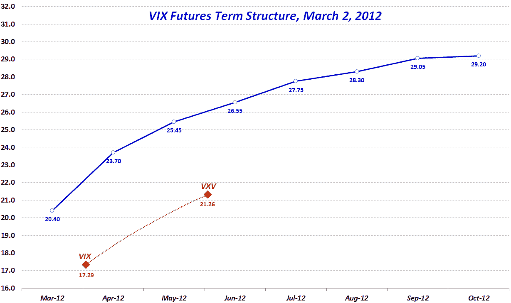

<!--yml

类别：未分类

date: 2024-05-18 16:37:09

-->

# VIX and More: Volatility Indices vs. Futures

> 来源：[`vixandmore.blogspot.com/2012/03/volatility-indices-vs-futures.html#0001-01-01`](http://vixandmore.blogspot.com/2012/03/volatility-indices-vs-futures.html#0001-01-01)

CBOE 波动率指数，也被称为 VIX，是所有波动率指数中最著名和最广泛引用的。它衡量了市场对标普 500 指数（SPX）未来 30 个日历日内波动率的预期。但鲜为人知的是（尽管我已经努力），VIX 还有一个较少人知道的兄弟，用于衡量 SPX 未来 93 个日历日内波动率的预期：[VXV](http://vixandmore.blogspot.com/search/label/VXV)。

除了波动率指数，还有[VIX 期货](http://vixandmore.blogspot.com/search/label/VIX%20futures)的市场；最近，这些市场已经延伸到未来八或九个月。尽管 VIX 和 VXV 评估了未来窗口的整个波动率，但 VIX 期货是市场对未来各个时间点 VIX 值的最佳猜测。*[这种区别与会计中资产负债表的快照与损益表或现金流量表中的流量之间的区别并不大。]*因此，一个衡量未来 93 个日历日内波动率的指数可能会得出一个与市场参与者试图估计 93 天后某一特定时间点的 VIX 值的 VIX 期货产品不同的值。

对于大部分情况而言，VIX 和 VXV 之间的关系（这是基于一系列 SPX 期权的[隐含波动率](http://vixandmore.blogspot.com/search/label/implied%20volatility)计算得出的）与 VIX 期货（其价值基于市场价格）之间的关系相当密切。

然而，最近，波动率指数的值要比相应时间段的期货价值便宜得多。在下图中，VIX 期货[期限结构](http://vixandmore.blogspot.com/search/label/term%20structure)（至少前八个月的部分）由蓝线表示，而 VIX 和 VXV 则是红色点和虚线连接线，远低于 VIX 期货的值。

精明的交易者可能会找到利用这一点和一些相关价格差异的方法。然而，每个人都可以自由地思考 SPX 期权交易者与 VIX 期货交易者之间的脱节源头。

相关帖子：

**

*[来源：芝加哥期权交易所（CFE），芝加哥]*

****披露：*** *芝加哥期权交易所是 VIX 和更多的广告客户**
