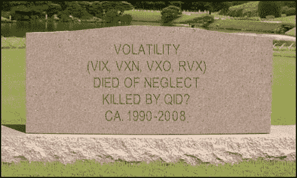

-   虽然我没有确切的答案，但我有一些工作假设，我时不时地调整，没有特定的顺序：

-   VIX 和 More：波动性 RIP？

-   <!--yml

-   虽然我没有确切的答案，但我有一些工作假设，我时不时地调整，没有特定的顺序：

# -   date: 2024-05-18 18:47:04

> -   预计即将出现的紧急利率削减限制了看跌期权的上涨潜力

-   category: 未分类

-   未分类

-   底线是，我无法解释为什么波动率指数似乎相对漠不关心许多人认为这是熊市开始的迹象。当然，只有当整体投资者不担心熊市时，这种相对的平静才可能存在-上次投资者在市场急剧下跌时没有恐慌是什么时候？

-   我已经相当详细地谈论了市场在过去一个月左右的波动性惊人地缺乏，尤其是考虑到当前经济衰退的严重程度和各种充斥着压抑情绪的新闻。至少有一段时间，我们可以忽略这一现象，并把它归因于“[日历反转](http://vixandmore.blogspot.com/search/label/calendar%20reversion)”。现在节假日季节已经过去，这种解释已经站不住脚了，而且似乎每个人都想知道为什么 VIX 只停留在 20 左右。

1.  -   我已经相当详细地谈论了市场在过去一个月左右的波动性惊人地缺乏，尤其是考虑到当前经济衰退的严重程度和各种充斥着压抑情绪的新闻。至少有一段时间，我们可以忽略这一现象，并把它归因于“[日历反转](http://vixandmore.blogspot.com/search/label/calendar%20reversion)”。现在节假日季节已经过去，这种解释已经站不住脚了，而且似乎每个人都想知道为什么 VIX 只停留在 20 左右。

1.  -   如果我能找到一个更好的答案，我将从波动中心切入实时信息...

1.  -   VIX 和 More：波动性 RIP？

1.  需要翻译但保留链接：[`vixandmore.blogspot.com/2008/01/volatility-rip.html#0001-01-01`](http://vixandmore.blogspot.com/2008/01/volatility-rip.html#0001-01-01)

-   -->
