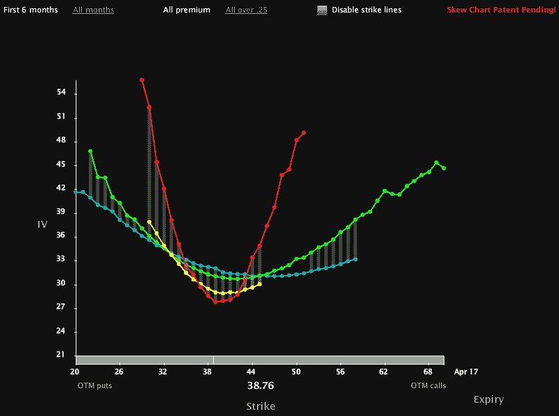

<!--yml

类别：未分类

日期：2024-05-18 17:12:46

-->

# VIX 和 More：来自 Livevol 的波动率偏斜图

> 来源：[`vixandmore.blogspot.com/2010/03/volatility-skew-charts-from-livevol.html#0001-01-01`](http://vixandmore.blogspot.com/2010/03/volatility-skew-charts-from-livevol.html#0001-01-01)

[昨天的帖子](http://vixandmore.blogspot.com/2010/03/etfreplaycom-brings-etfs-volatility-and.html) 关于 [ETFreplay.com](http://etfreplay.com/) 引发了很多对这个网站及其图形的好评，让我想到我忘记提到 [Livevol](http://livevol.com/) 已经在 Livevol Pro 中添加了一些新的波动率偏斜图形。

在下面的图表中，我捕捉到了[隐含波动率](http://vixandmore.blogspot.com/search/label/implied%20volatility)在[USO](http://vixandmore.blogspot.com/search/label/USO)中的偏斜图。在我打字时，USO 正好在 39 美元以下，Livevol 图表捕捉到了四月（红线）、五月（黄线）、七月（绿线）和十月（蓝线）期权的 IV 偏斜。四月份的前月期权有一个陡峭的笑容，而七月的期权反映了更经典的较平的笑容。请注意，五月的期权看起来更像是一个冷笑。我还没有讨论过[偏斜度](http://vixandmore.blogspot.com/search/label/skew)，但我认为现在是时候博客深入研究希腊字母、波动率偏斜和一些更高级的期权分析了，所以这绝对是我未来要做的事情清单上的一项。

如果有人希望了解更多关于这些偏斜图形并更好地理解它们的方法，一个很好的起点是[Livevol 博客](http://livevol.blogspot.com/)。

最后，我不禁想知道，是否只有我在看这些偏斜图表时会想起[极光](http://en.wikipedia.org/wiki/Aurora_%28astronomy%29)...

对于更多相关主题，读者被鼓励查看：

*[来源：Livevol Pro]*

***披露：*** *Livevol 是 VIX and More 的* 广告商 *
