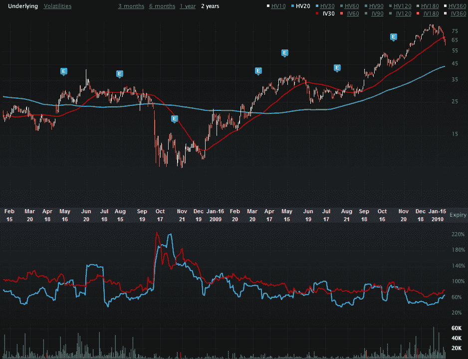

<!--yml

类别：未分类

日期：2024 年 05 月 18 日 17 时 16 分 54 秒

-->

# VIX and More：波动性聚光灯：InterOil（IOC）

> 来源：[`vixandmore.blogspot.com/2010/01/volatility-spotlight-interoil-ioc.html#0001-01-01`](http://vixandmore.blogspot.com/2010/01/volatility-spotlight-interoil-ioc.html#0001-01-01)

我在博客上首次将个别股票放在波动率显微镜下的第一个是 InterOil ([IOC](http://vixandmore.blogspot.com/search/label/IOC))。我在 2007 年 7 月[突出](http://vixandmore.blogspot.com/2007/07/individual-stock-volatility-interoil.html)它的时候，这支股票的交易价格仅略高于 22，但引起我注意的是它的天文数字的隐含波动率（IV）和历史波动率（HV）读数都超过 150。我当时宣称：“这是一桶火药”，这可能是一种轻描淡写。在我发表文章的一个月内，IOC 的交易价格飙升至 42.00 美元，之后跌至 18.37 美元，因为人们猜测 IOC 在巴布亚新几内亚的石油和天然气勘探工作的性质和范围。在 2008 年，牛熊之间的战斗继续进行，全年的隐含波动率均在三位数，并且金融危机将该股票推至年初涨至 41.62 美元后的 8.90 美元。

2009 年的事件终于给了牛市支撑，因为连续创下世界纪录的天然气发现并得到了高调投资者（如乔治·索罗斯和 T·布恩·皮肯斯）的大笔持股。随着故事慢慢展开，这支股票一路飙升至 70 多美元，并在本月初达到 84.05 美元的高位。

我写这篇文章的时候，这支股票现在交易价格约为 62。由于巴布亚新几内亚缺乏信息，这支股票一直是一种诡异的形式的罗夏克测试，大部分时间都是基于纯粹的投资者情绪和动量交易。

下图，由[Livevol](http://www.livevol.com/)提供，展示了两年的股价历史（顶部图表，50 日移动平均线为红色，200 日移动平均线为紫色），以及两年的 20 日历史波动率（蓝色）和 30 日隐含波动率（红色）。这张图表上有很多有趣的数据点。我特别感兴趣的一个是，尽管股价从 2009 年 6 月开始翻了三倍，但隐含波动率自那时以来保持相对稳定。过去一个月左右，隐含波动率和历史波动率都呈稳定上升趋势，也许预示着最近的 26%下跌，也可能表明更多的火药即将爆炸。历史上，IOC 的历史波动率一直难以超过其隐含波动率，但一条重大新闻可以迅速改变这种情况。

欲了解更多相关主题，请读者查看：

对于那些想要深入了解 IOC 故事细节的人，可以在[shareholdersunite.com](http://shareholdersunite.com/category/ioc/)找到大量信息的优秀资源。

*[来源：Livevol Pro]*

***披露：*** *写作时持有 IOC 长期投资；* *Livevol 是* *VIX and More* 的广告商
