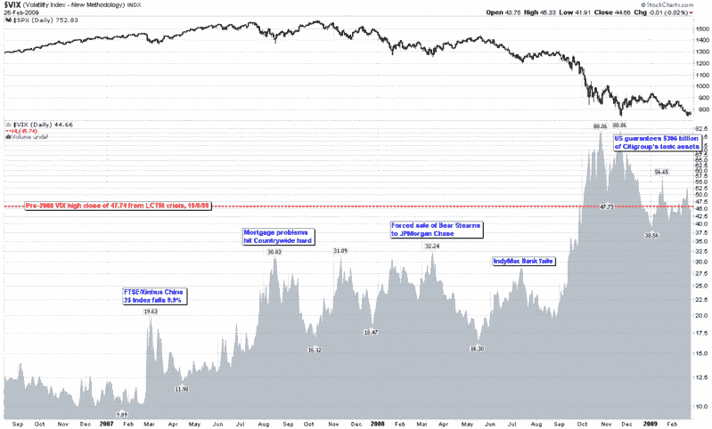

<!--yml

类别：未分类

日期：2024-05-18 17:57:48

-->

# VIX and More：波动率风暴两年来持续…

> 来源：[`vixandmore.blogspot.com/2009/02/volatility-storm-at-two-years-and.html#0001-01-01`](http://vixandmore.blogspot.com/2009/02/volatility-storm-at-two-years-and.html#0001-01-01)

正是两年前的今天，[中国](http://vixandmore.blogspot.com/search/label/China) 传来了波动率风暴的第一阵风。回顾 [2007 年 2 月 27 日](http://vixandmore.blogspot.com/search/label/February%2027)，中国政府加息以遏制投机的担忧导致上海综合指数下跌 8.8%，而作为中国 ETF [FXI](http://vixandmore.blogspot.com/search/label/FXI) 基础的富时新华中国 25 指数下跌 9.9%。

在对脱钩理论的早期挑战中，全球股市同步下跌，道琼斯工业平均指数当天下跌 416 点，收于 12,216 点。虽然两年后，这一天 [VIX 暴涨](http://vixandmore.blogspot.com/2007/02/birthday-party.html) 达到 64%，但在谈论大幅 [VIX 暴涨](http://vixandmore.blogspot.com/search/label/VIX%20spikes) 时，VIX 未能突破十几岁的情况似乎有些过时了。

正如下图所示，在二月 VIX 暴涨之后，VIX 的底部从 10.00 上涨到 12.00，然后这一底部不断上升，首先到 15，然后到 16、18 和 22。事实上，更高低点的模式持续了一年多。

在 StockCharts 图表中，我选择将波动率显示为面积图，以强调波动率的上升趋势。尽管 2008 年 5 月的底部印刷出现了较低的低点，7 月份的印第安纳波利斯银行失败显示出较低的高点，但这事实上是在 2008 年 9 月之前波动率风暴释放全部力量之前最后一次看到某种程度上的正常波动率。为了便于参考和存档，我突出显示了过去两年中一些重要顶部与一些基本事件同时发生的情况。

从中国大跌和全球波动性蔓延到现在已经两年，但只有少数人敢于冒险预测最糟糕的时期已经过去。

坦率地说，我认为在接下来的十年内 VIX 再次收于 80 以上的可能性很小，尽管这当然并不是不可能的事情，但两年前没有人预测到维持 VIX 在 40 以上水平五个月会如此容易。

这场风暴最终会自行停息，但海岸线永远不会再回到过去的模样。

*[来源：StockCharts]*
