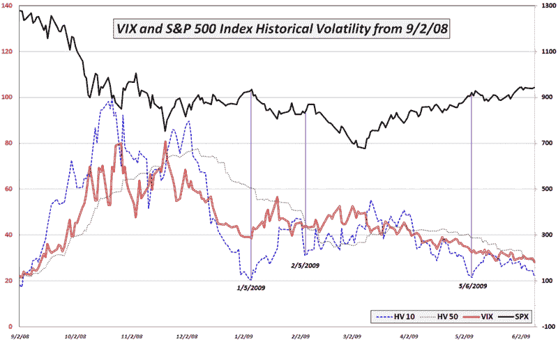

<!--yml

分类：未分类

日期：2024-05-18 17:43:45

-->

# VIX and More：VIX 在雷曼兄弟后期最低水平的情况下的波动性

> 来源：[`vixandmore.blogspot.com/2009/06/volatility-in-context-with-vix-at-post.html#0001-01-01`](http://vixandmore.blogspot.com/2009/06/volatility-in-context-with-vix-at-post.html#0001-01-01)

昨天，VIX 收盘为 28.27，自 2008 年 9 月 12 日 VIX 收盘在 25.66 水平以来最低，即雷曼兄弟破产申请日的星期五。

除了 VIX 的新低之外，标普 500 指数中一些[历史波动率](http://vixandmore.blogspot.com/search/label/historical%20volatility)（HV）的测量指标也处于自雷曼兄弟破产周以来的水平。这些包括 20 日 HV（24.65），30 日 HV（25.50）和 50 日 HV（28.57）。此外，虽然 10 日 HV 尚未跌破最近 5 月和 1 月的低点，但以 21.54 的水平，这种数字令那些认同 30+VIX 的人感到更加紧张。

罪魁祸首是最近的区间交易，在这种交易中，昨天 SPX 上涨了 3.29 点，实际上是过去三个交易日中最大的日内变化。在过去六个交易日中，SPX 几乎没有动，这导致历史波动率（也称为实现波动率）急剧下降。

下面的图表显示了自去年 9 月以来 VIX 和 SPX 的历史波动情况。请注意，自 3 月低点以来，VIX 一直与突出的 10 日和 50 日历史波动度指标一起下降。还请注意，上次 10 日 HV 明显领先于 VIX（1/5、2/5 和 5/6）时，这每次都是 SPX 顶部行动的前兆。随着 SPX 的 10 日历史波动再次领先于 VIX，合理地问是否这种模式将继续，我们是否将在未来几天内看到另一个顶部模式。

*[图表：VIXandMore]*
