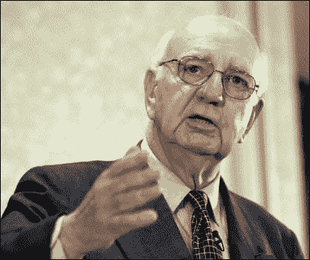

<!--yml

category: 未分类

date: 2024-05-18 18:44:55

-->

# VIX and More: 沃尔克支持奥巴马

> 来源：[`vixandmore.blogspot.com/2008/02/volker-endorses-obama.html#0001-01-01`](http://vixandmore.blogspot.com/2008/02/volker-endorses-obama.html#0001-01-01)

我尽力让博客中远离政治，但我觉得前联邦储备主席保罗·沃尔克几天前宣布他支持巴拉克·奥巴马的事情尤为有趣。让我困惑的是，这个项目获得的新闻报道如此之少，这也是我在这个空间里提到它的主要原因。

在这里，我们可能是几十年来最重要的总统选举之一，一个几乎在任的总统候选人，其丈夫恰好是过去 35 年中唯一能够平衡预算的总统。此外，尽管伊拉克战争，经济正在成为竞选中的关键问题，突然间我们有了最著名和受尊敬的联邦储备主席，他支持……那个被批评者嘲笑缺乏经验的新面孔。

我发现以下 Volcker 的引用尤为显著：

> "只有巴拉克·奥巴马，他的人格，他的思想，他理解和表达我们的需求和希望的能力，才具备了强大和新鲜领导的潜力。"
