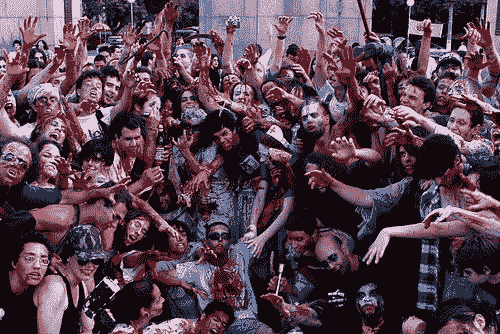

<!--yml

类别: 未分类

日期: 2024-05-18 18:04:43

-->

# VIX and More: Voodoo and Solvency, Krugman vs. Hempton

> 来源：[`vixandmore.blogspot.com/2009/01/voodoo-and-solvency-krugman-vs-hempton.html#0001-01-01`](http://vixandmore.blogspot.com/2009/01/voodoo-and-solvency-krugman-vs-hempton.html#0001-01-01)

 随着欧美银行国有化的讨论升温，我想确保每个人都有机会阅读保罗·克鲁格曼在周日《纽约时报》上的[Wall Street Voodoo](http://www.nytimes.com/2009/01/19/opinion/19krugman.html?_r=1&em)。克鲁格曼探讨了所谓的‘[僵尸银行](http://vixandmore.blogspot.com/search/label/zombie%20bank)’的问题，这些银行在技术上已经资不抵债，但其市值“完全基于股东将被政府救助”的希望。

克鲁格曼提出了三种处理这些僵尸银行的政策选择：

1.  充足的政府资金来支持现有实体的运作

1.  由 FDIC 接管银行，并将有毒资产转移到第三方（类似于解决信托公司模式的‘坏银行’或‘聚合银行’），然后重新出售现在已经偿付能力的银行

1.  将有毒资产转移到第三方，而无需政府先前接管银行

克鲁格曼担心的是，奥巴马政府倾向于第三种选择，这将以损害纳税人为代价，以纵容道德风险问题。

约翰·赫姆普顿在[Voodoo Maths and Dead Banks](http://brontecapital.blogspot.com/2009/01/voodoo-maths-and-dead-banks.html)中提出了对僵尸银行偿付能力问题的挑战。赫姆普顿声称，当前负债超过资产的银行可以通过净利差足够产生足够的营业收入来弥补资产和负债之间的差距，希望能在几年内实现偿付能力。

赫姆普顿提出了一些很好的观点，并为当前方法提供了哲学基础。鉴于有很多变数，这些努力的成功最终将取决于几个关键因素，包括：

+   资产和负债之间的差距

+   银行未来能够实现的利差（净利差）

+   经济收缩的长度

从政府政策的角度来看，货币政策将对银行的利差产生很大影响，财政政策将决定经济收缩的幅度和持续时间。

僵尸银行可以通过与房屋贷款欠款的房主一样的方式实现偿付能力，直到他们再次进入房屋的正资产情况。银行的关键在于健康的利率差和相对较短的经济衰退，以避免贷款损失失控。

支撑僵尸银行的问题在于，这可能是一个政治上过于吸引人的替代方案，以至于无法促使对其他选择进行适当考虑。此外，由于过分乐观估计负债和资产之间差距的倾向，以及希望变成相信经济低迷将比下一个权威说的更短的愿望，僵尸银行始终看起来比它们应该更有吸引力。
