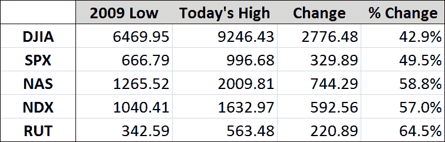

<!--yml

category   类别：未分类

日期：2024-05-18 17:36:08

-->

# VIX and More：等待一条分界线

> 来源：[`vixandmore.blogspot.com/2009/07/waiting-for-line-in-sand.html#0001-01-01`](http://vixandmore.blogspot.com/2009/07/waiting-for-line-in-sand.html#0001-01-01)

火箭推动的涨势今早继续，今天的涨势以常强劲的广度和上升的交易量领先于我写这篇文章时下跌的交易量超过 10-1。

迟早，牛市将会失去动力，熊市也会厌倦后退，我们将会看到一定程度的顶部形成。随着 SPX 1000 就在眼前，明天将是本月的最后一个交易日，而且一些超买信号正被推向极端，今天或明天看起来是任何活着的熊市的不错阵地。

下面的图表显示，自三月低点以来，五个主要指数已经从 43%（道琼斯工业平均指数）上涨到 64%（罗素 2000 小型股指数）。

除了是一个很好的圆整数字和心理支撑与阻力来源之外，SPX 1000 还标志着从 三月底 反弹了 50%。如果熊市无法将 SPX 控制在 1010 以下，那么在上涨到 1050 的过程中几乎没有任何阻力。

我预计很快会有一条分界线出现 - 而且我认为它会具有一定的持久力。

