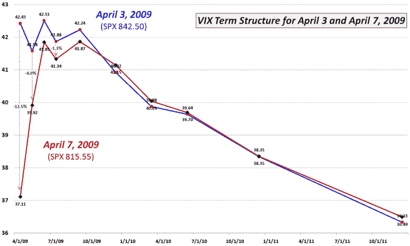

<!--yml

分类: 未分类

日期: 2024-05-18 17:52:50

-->

# VIX 与更多：等待下一个鞋子何时落地？

> 来源：[`vixandmore.blogspot.com/2009/04/waiting-for-next-shoe-to-drop.html#0001-01-01`](http://vixandmore.blogspot.com/2009/04/waiting-for-next-shoe-to-drop.html#0001-01-01)

有很多关于经济哪个角落可能最先崩溃并开始撰写当前金融危机下一章的猜测。信用卡债务和商业地产是最经常被提及的潜在罪魁祸首之一，但近来东欧银行处境严峻，罗马尼亚、保加利亚和匈牙利的信用违约掉期也在上升。

直到周一晚上我进行[VIX 今日跳涨](http://vixandmore.blogspot.com/2009/04/todays-jump-in-vix.html)的调查，我才意识到恐惧的潜流有多强。从各种公开和私人评论中可以清楚地看出，有一大批资深投资者预期不仅下一个鞋子很快就会落地，而且后果将至少与我们在危机高峰期 10 月至 11 月期间经历的一样严重。

尽管在这个阶段我不排除任何可能性，但我不认为 VIX 在不久的将来会飙升到 60 以上，甚至我也不认为 VIX 超过 50 是可能发生的情景。

上个星期五，标普 500 指数（SPX）创下自 3 月 6 日“恶魔底部”666.79 点以来的最高收盘价。从上周五的 842.50 收盘到周二的 815.55 收盘，SPX 下跌了 3.2%。在同一时期，现货 VIX 仅上涨了 1.7%，从 39.70 上涨到 40.39。然而，在下面的图表中，我们可以看到，即使现货 VIX 上涨，4 月、5 月、6 月、7 月和 9 月的 SPX 期权波动率实际上下降了，其中 4 月到期的波动率下降了 12.5%，5 月的波动率下降了 4%，而 6 月到 9 月的波动率则下降了 0.9%至 1.6%。换句话说，对于今年余下时间的波动性预期，以及可能的恐惧和不确定性，仍然指向改善。

当然，总会有一群交易者，当 VIX 无法衡量他们认为合适的恐惧水平时，会感到恐慌。我时不时能够理解这群人的担忧，他们无疑会将漠不关心的 VIX 视为更加担心未来的理由。

至少目前，VIX [期限结构](http://vixandmore.blogspot.com/search/label/term%20structure)指向市场投资者信心增强，对市场重力与过大鞋类不祥现象的担忧逐渐减少。

*[来源: CBOE, VIXandMore]*
