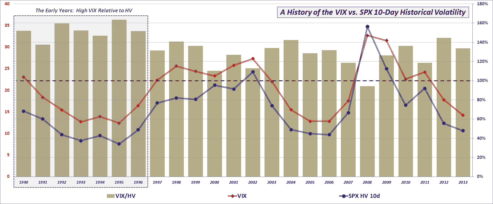

<!--yml

类别：未分类

日期：2024 年 05 月 18 日 16:11:58

-->

# VIX and More：2013 年 VIX 太低了吗？不是…

> 来源：[`vixandmore.blogspot.com/2014/01/was-vix-too-low-in-2013-no.html#0001-01-01`](http://vixandmore.blogspot.com/2014/01/was-vix-too-low-in-2013-no.html#0001-01-01)

曾经有一段时间，投资者普遍担心 VIX “太高”，并由此可能存在某种未被发现的威胁，这种威胁未在他们的雷达上显示出来。在过去的几年里，情况已经反转，现在我发现投资者更多地表达对低 VIX 的担忧，而不是高 VIX。是的，有一些人（实际上是许多人）开始在市场未反映出他们认为应有的焦虑和[恐惧](http://vixandmore.blogspot.com/search/label/fear)时变得焦虑和恐惧。对于那些仍然想起[2008 年](http://vixandmore.blogspot.com/search/label/2008)的战斗伤痕的人来说，这种现象似乎是一个反复出现的问题。 （有关此信息的更多信息，请参阅我的关于[灾难印记](http://vixandmore.blogspot.com/search/label/disaster%20imprinting)的帖子。）

那么…2013 年的 VIX 太低了吗？为了回答这个问题，我更新了我在 2012 年 10 月最后呈现的图表：[VIX 相对实现波动性的比率自 1996 年以来最高](http://vixandmore.blogspot.com/2012/10/ratio-of-vix-to-realized-volatility.html)。

正如图表所示，2013 年标准普尔 500 指数的（平均）VIX 和 10 天的[历史波动率](http://vixandmore.blogspot.com/search/label/historical%20volatility)（HV）都处于相对较低的水平。更重要的是，VIX 在整个年份中维持了对标准普尔 500 指数 10 天 HV 的平均溢价，溢价率为 34%，这与自 1990 年以来大约 35% 的历史规律相一致。

*[来源：CBOE，Yahoo]* 

虽然我在计算历史规律时使用了 CBOE 提供的数据，回溯到 1990 年，但我认为值得注意的是，从 1990 年到 1996 年，VIX 相对于标准普尔 500 指数的历史波动性的溢价通常比近年来高得多，因此，尽管长期 VIX 溢价 HV 约为 35%，但 1996 年后的平均溢价更接近 26%。因此，如果您真的需要强调 2013 年的 VIX “太低”，您总是可以拿出 1996 年后的数据，但否则，请考虑在过去一年中 VIX 处于历史波动性水平的位置几乎正好。

最后但同样重要的是，图表还说明了，尽管 VIX 和 SPX HV 在数年内确实存在趋势，但两者的比率具有更随机的运动，因此对于 2014 年的预测更加困难。

相关帖子：

***披露：*** *CBOE 是 VIX and More 的广告商*
