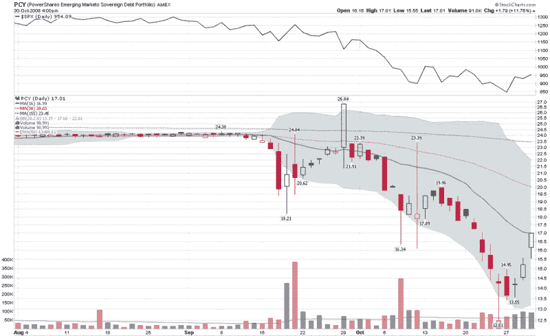

<!--yml

类别：未分类

日期：2024-05-18 18:17:58

-->

# VIX and More: 观察新兴市场债券

> 来源：[`vixandmore.blogspot.com/2008/10/watch-emerging-market-bonds.html#0001-01-01`](http://vixandmore.blogspot.com/2008/10/watch-emerging-market-bonds.html#0001-01-01)

我知道许多仅投资于股票的投资者在过去一年中开始第一次关注债券市场，因为他们厌倦了被跨市场关系所盲目击中。

在许多信贷市场数据点中，[LIBOR](http://vixandmore.blogspot.com/search/label/LIBOR)，[TED spread](http://vixandmore.blogspot.com/search/label/TED%20spread)，OIS-LIBOR 等最近受到了相当多的关注，作为流动性的衡量标准。更传统的债券市场指标更侧重于风险而不是流动性，包括公司债券与政府债券之间的利差，或投资级和高收益公司债券之间的利差。

我想推荐另一个债券市场指标——一个可以反映全球经济运行情况的指标。 PowerShares 新兴市场主权债务投资组合是一个 ETF，其股票代码为[PCY](http://finance.yahoo.com/q?s=PCY)。该 ETF 于 2007 年 10 月推出，一年的图表显示，在上个月的[雷曼兄弟](http://vixandmore.blogspot.com/search/label/LEH)倒闭之前，历史波动率在 5-10%的范围内。在一个半月的纯混乱之后，历史波动率现在超过 100%。如下图所示，PCY 在过去一个月中几乎失去了一半的价值，并且似乎在上周五触底。请注意，在过去几天中出现的新买入兴趣，因为投资者已将[新兴市场](http://vixandmore.blogspot.com/search/label/emerging%20markets)债券视为一种价值投资。

在许多方面，新兴市场是当今全球经济面临的许多问题的焦点，从信贷危机到对[大宗商品](http://vixandmore.blogspot.com/search/label/commodities)的需求，再到未来全球增长的前景。不仅要将 PCY 视为一个指标，还要看看它的投资潜力。

[来源：StockCharts]
