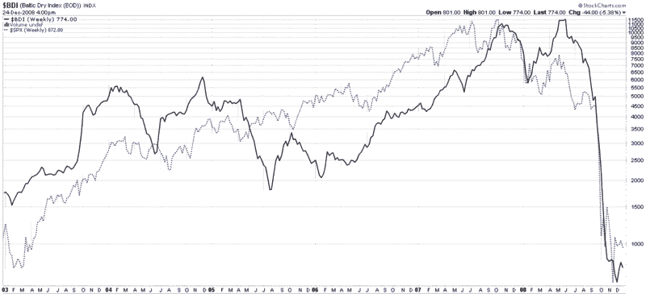

<!--yml

类别：未分类

日期：2024-05-18 18:08:24

-->

# VIX 和 More：2009 年关注波罗的海干散货运价指数

> 来源：[`vixandmore.blogspot.com/2008/12/watch-baltic-dry-index-in-2009.html#0001-01-01`](http://vixandmore.blogspot.com/2008/12/watch-baltic-dry-index-in-2009.html#0001-01-01)

2009 年，投资者将在全球范围内寻找经济复苏或恶化的迹象。 他们应该关注的众多工具之一，以评估全球贸易的强度，是[波罗的海干散货运价指数](http://en.wikipedia.org/wiki/Baltic_Dry_Index)（BDI）。 波罗的海干散货运价指数衡量运输煤炭、铁矿石和其他矿石、可可、粮食、磷肥、化肥、饲料等[散货船](http://en.wikipedia.org/wiki/Bulk_carrier)的运费。 简而言之，BDI 是全球贸易的一个很好的代理。

在下面的图表中，请注意 BDI 在 2007 年的标普 500 指数达到峰值后和上个月的 SPX 底部。 BDI 可能不是一个领先的指标，但它是确认全球股票涨跌是否反映在全球航运增加中的重要方式。 如果 BDI 在 2009 年未能上涨，请对股票的任何上涨持怀疑态度。

对于那些对跟踪一些主要干散货运输公司股票感兴趣的人，一个好的起点是[戴安娜航运](http://vixandmore.blogspot.com/search/label/DSX)（DSX）、DryShips ([DRYS](http://vixandmore.blogspot.com/search/label/DRYS)) 和 Excel Maritime Carriers ([EXM](http://vixandmore.blogspot.com/search/label/EXM))。

*[来源：StockCharts]*
