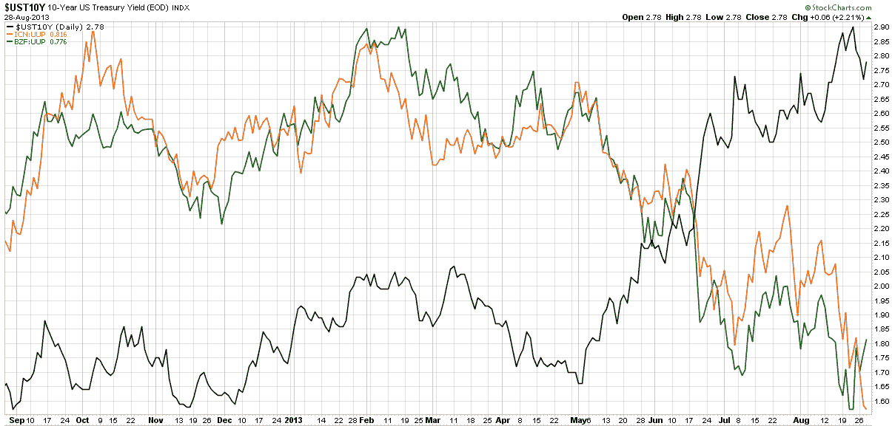

<!--yml

类别: 未分类

日期: 2024-05-18 16:13:39

-->

# VIX 和 More：关注两个关键新兴市场货币

> 来源：[`vixandmore.blogspot.com/2013/08/watching-two-key-emerging-markets.html#0001-01-01`](http://vixandmore.blogspot.com/2013/08/watching-two-key-emerging-markets.html#0001-01-01)

随着叙利亚和美联储成为近几天头条新闻的焦点，我想知道有多少人将新兴市场货币列为他们关注的重点。我猜想很少有人每天都在研究印度（[EPI](http://vixandmore.blogspot.com/search/label/EPI)）、印度尼西亚（[EIDO](http://vixandmore.blogspot.com/search/label/EIDO)）、巴西（[EWZ](http://vixandmore.blogspot.com/search/label/EWZ)）、土耳其（[TUR](http://vixandmore.blogspot.com/search/label/TUR)）、南非（[EZA](http://vixandmore.blogspot.com/search/label/EZA)）、泰国（[THD](http://vixandmore.blogspot.com/search/label/THD)）和菲律宾（[EPHE](http://vixandmore.blogspot.com/search/label/EPHE)）等国的股票。事实上，我敢打赌，很少有人甚至知道有一个专门用于投资菲律宾的 ETF。

尽管密切关注特定国家的股票很重要，但目前新兴市场问题的核心是货币波动。当然，货币问题实际上不过是美国升息的一种下游效应，这是由于对美联储量化宽松（QE）计划的预期发生了变化。自 2008 年 12 月以来，美联储使用了各种政策工具来尽可能地降低美国的利率，并有效地将资金转移到新兴市场，其中高收益投资看起来更有吸引力。随着量化宽松开始逐步解除，新兴市场的易货币供应突然中断，而拥有大额经常账户赤字和以美元计价的贷款（将以本币偿还，而该本币价值正在迅速下降）的国家尤其脆弱。

由于许多股票投资者无法获得完整的货币交叉汇率表，我认为重要的是要注意到有跟踪两个最重要的新兴市场货币的交易所交易产品（ETPs）：

+   WisdomTree 印度卢比 ETF ([ICN](http://vixandmore.blogspot.com/search/label/ICN))

+   WisdomTree 巴西雷亚尔 ETF ([BZF](http://vixandmore.blogspot.com/search/label/BZF))

在下面的图表中，我展示了美国 10 年期国债收益率（UST10Y）的收益率（黑线），以及印度卢比对美元的比率（ICN:UUP）（橙色），以及巴西雷亚尔对美元的比率（BZF:UUP）（绿色）。现在这些是 ETF 对 ETF 的比率，而不是精确的货币交叉比率，但图表几乎相同（并且可以在 StockCharts.com 上轻松构建），而关键的要点必然是相同的。请注意，直到 5 月，ICN 和 BZF 相对于美元似乎更与美国利率正相关，而不是负相关。一旦利率在 5 月初开始上升，ICN 和 BZF 都开始迅速失去对美元的支撑，与美国利率的负相关性突然变得非常强烈。

值得注意的最后一点是，在过去一周中，BZF:UUP 比率出现了反弹，而 ICN:UUP 比率继续恶化，因为几乎没有迹象表明印度卢比正在稳定，即使巴西稍有改善。

*[来源：StockCharts.com]*

对于那些有兴趣评估新兴市场风险和不确定性的人来说，最近的[VEXXM 作为新兴市场波动性和风险的衡量](http://vixandmore.blogspot.com/2013/06/vxeem-as-measure-of-emerging-markets.html)是推荐阅读的一篇文章，可以为一些背景和信息提供[关于 VXEEM](http://vixandmore.blogspot.com/search/label/VXEEM)、CBOE 新兴市场 ETF 波动率指数的阅读。

相关帖子：

***披露：*** *写作时长期持有 EWZ*
