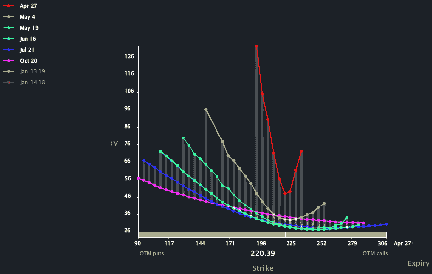

<!--yml

类别：未分类

日期：2024-05-18 16:31:40

-->

# VIX 与更多：周期期权势头强劲

> 来源：[`vixandmore.blogspot.com/2012/04/weekly-options-coming-on-strong.html#0001-01-01`](http://vixandmore.blogspot.com/2012/04/weekly-options-coming-on-strong.html#0001-01-01)

大约两年前，当芝加哥期权交易所推动扩大对[周期期权](http://vixandmore.blogspot.com/search/label/weeklys)的兴趣时，他们的努力最初受到了相当多的怀疑。然而，随着时间的推移，周期期权已经拥有了一批忠实的追随者，“周期期权”从总成交量的 1%增长到了今天的约 15%。两年前，周期期权列表中有少量指数期权，以及少量基于 ETPs 和个股的周期期权。周期期权列表每周都在变化，但是当前[截至 5 月 4 日到期的周期期权列表](http://www.cboe.com/publish/weelkysmf/weeklysmf.xls)现在包括六个指数的期权，26 个 ETP 和 119 只个股的期权。曾经是一种好奇，现在成为了一股浪潮。

就我个人而言，我发现周期期权有相当多的用途。例如，周二，我在推特上发表了[VXX](http://vixandmore.blogspot.com/search/label/VXX) 18/19 认购价差期权与下个月标准到期日 5 月 19 日的价格相同。

周期期权吸引力的一部分可以从下面的图表中看出，该图表展示了亚马逊（[AMZN](http://vixandmore.blogspot.com/search/label/AMZN)）的偏度，今天的 4 月 27 日到期的周期期权（红线）与更远到期期权相比有着巨大的[隐含波动率](http://vixandmore.blogspot.com/search/label/implied%20volatility)（因此价格）溢价。从图表中可以看出，构建具有周期期权的头寸（还包括显示为黄线的 5 月 4 日期权）并不那么困难，其中一个腿的隐含波动率比另一个腿高出 50-100%。如果你像我一样倾向于卖出期权，这有时会提供一种无法抗拒的数学优势。

最近，当我发现自己在编辑各种观察名单时，我首先检查的是所涉及的基础资产是否有周期期权。如果你有周期期权，你就处于大联盟中，而且有更多的交易机会。例如，本周添加了[ZNGA](http://vixandmore.blogspot.com/search/label/ZNGA)周期期权，因此，昨天的业绩报告周围的交易便得到了显着改善。

如果你还没有尝试过周期期权，那么你就错过了。如果你认为交易量太小，市场太薄弱，那么你就要重新考虑了。

*[请注意，关于周期期权的所有相关信息的绝佳来源是* [*芝加哥期权交易所周期期权主页*](http://www.cboe.com/micro/weeklys/introduction.aspx)*。]*

相关帖子：

**

*[来源：LivevolPro.com]*

***披露：*** *本文撰写时空头做空 VXX 和 ZNGA；Livevol 是 VIX 与更多内容的广告商*
