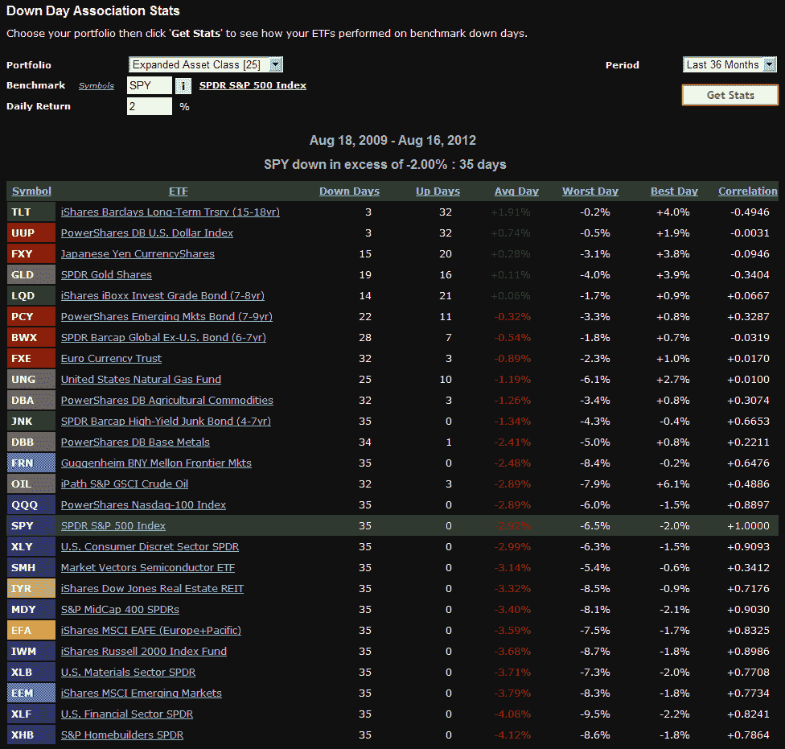

<!--yml

类别：未分类

日期：2024 年 05 月 18 日 16:25:24

-->

# VIX and More: 如果股票下跌会怎样？

> 来源：[`vixandmore.blogspot.com/2012/08/what-if-stocks-decline.html#0001-01-01`](http://vixandmore.blogspot.com/2012/08/what-if-stocks-decline.html#0001-01-01)

成功的投资者总是为各种意外情况做计划，因此可以推断，他们甚至应该为股票实际下跌的可能性做好准备...

我在考虑股票即将发生的调整以及如何调整我的投资组合以应对股票再次受到重力影响的时候，偶然发现了[ETFreplay.com](http://etfreplay.com/)上一个有趣的工具，他们称之为他们的“下跌日关联统计数据”。简而言之，它查看了一组用户指定的交易所交易产品在基准下跌 X%的那些日子的表现。

在下面的示例中，我选择了 SPY 作为我的基准，2%（每天）作为我的跌幅阈值，36 个月作为我的回看期。我查看了 25 个覆盖各种[资产类别](http://vixandmore.blogspot.com/search/label/asset%20class)和投资方法的 ETP。

从下跌日关联统计数据中得出的一些结果并不特别令人惊讶。例如，长期债券（[TLT](http://vixandmore.blogspot.com/search/label/TLT)）和美元（[UUP](http://vixandmore.blogspot.com/search/label/UUP)）与股票有强烈的负相关性，并且通常在 SPY 急剧下跌时表现良好。一些其他债券选择（[LQD](http://vixandmore.blogspot.com/search/label/LQD)、[PCY](http://vixandmore.blogspot.com/search/label/PCY)、[BWX](http://vixandmore.blogspot.com/search/label/BWX)）更擅长于保持不变而不是反向操作，但也显示了分散投资的好处。商品选择有些令人失望，通常最多只能损失 SPY 的一半，并且原油几乎与 SPY 的跌幅完全匹配。

令我感到惊讶的数据点之一是，在大跌日里，前沿 ETF（[FRN](http://vixandmore.blogspot.com/search/label/FRN)）的表现比 SPY 更好，而房地产（[IYR](http://vixandmore.blogspot.com/search/label/IYR)）的表现更糟。

当然，股票下跌的每一个原因都有不同的催化剂，并对不同的资产类别、行业和地理位置施加不同的压力，但是当股票继续上涨时，请务必为那个最终的回调做好准备，因为当它最终到来时，可能会在不便的时间和令人惊讶的速度下到来。

相关文章：

**

*[来源：ETFreplay.com]*

****披露：*** *撰写时持有 LQD**
