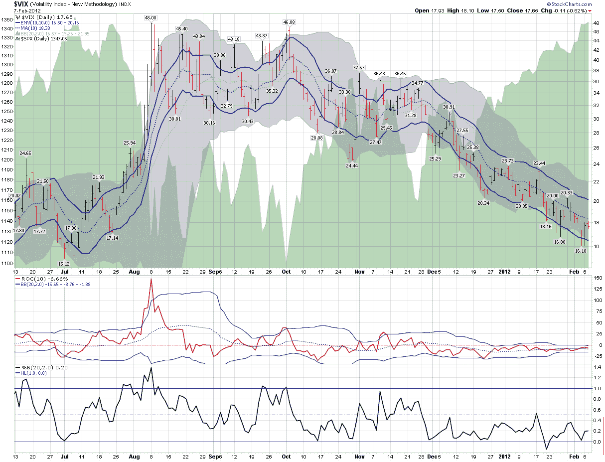

<!--yml

类别：未分类

日期：2024-05-18 16:40:54

-->

# VIX 和更多：VIX 厨房水槽图表的含义

> 来源：[`vixandmore.blogspot.com/2012/02/what-vix-kitchen-sink-chart-says.html#0001-01-01`](http://vixandmore.blogspot.com/2012/02/what-vix-kitchen-sink-chart-says.html#0001-01-01)

2012 年更有趣的发展之一是观察到那些大多集中在债务过剩和低甚至负增长之间的激烈悲观叙事的减少。然而，2012 年的乐观开局并没有促使许多人转向看涨阵营。相反，一开始只是耳语的“……过度买入……”已经变成了轻声低语，现在正变成了响亮的合唱。突然之间，普遍共识似乎是，股票根本不配拥有当前的高估值。

在这种环境下，许多投资者特别容易受到[确认偏见](http://vixandmore.blogspot.com/search/label/confirmation%20bias)的影响，他们争先恐后地寻找一个或多个指标，这些指标会告诉他们他们已经开始相信的事情：一个重大的调整可能就在眼前。

不管好坏，看 VIX 通常是那些寻找市场反转证据的人的首要选择之一。

在下面的图表中，我更新并扩展了三年前的一个图表，我称之为我的“VIX 厨房水槽图表”——因为它以多种不同的方式观察和检验 VIX。标准的 VIX 分析试图确定 VIX 是否偏离了历史规范，无论是以移动平均线，[布林带](http://vixandmore.blogspot.com/search/label/Bollinger%20bands)或其他机制的形式。我甚至在主要图表下方包括了一个单独的[变化率](http://vixandmore.blogspot.com/search/label/rate%20of%20change)研究（带有自己的布林带）和一个[布林带宽度](http://vixandmore.blogspot.com/search/label/Bollinger%20band%20width)研究，以提供一些额外的分析扭曲。

然而，底线是：如果股票被过度买入，而且确实即将发生调整，VIX 似乎并没有意识到这种必然性。相反，在芝加哥期权交易所波动指数的领域里，它看起来更像是一切如常。

相关帖子：

**

*[来源：StockCharts.com]*

***披露：*** *无*
