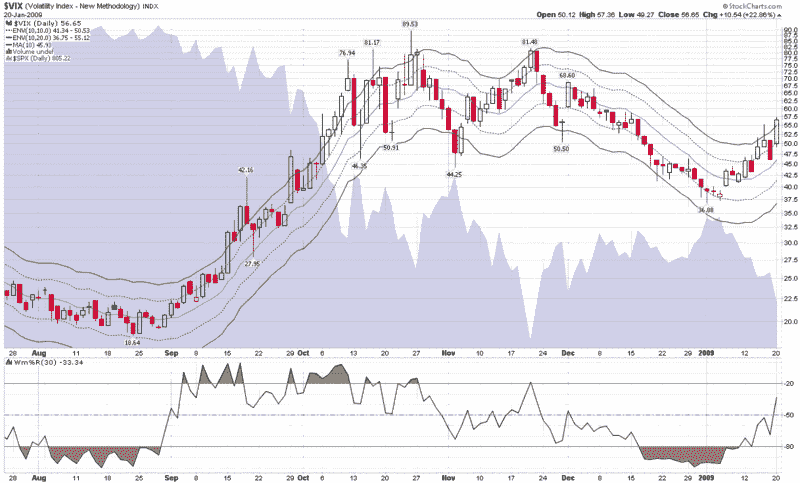

<!--yml

分类：未分类

日期：2024-05-18 18:04:32

-->

# VIX and More：VIX 对周二崩溃的看法

> 来源：[`vixandmore.blogspot.com/2009/01/what-vix-thinks-about-tuesdays.html#0001-01-01`](http://vixandmore.blogspot.com/2009/01/what-vix-thinks-about-tuesdays.html#0001-01-01)

我知道我不应该把 VIX 称为一个有思想的存在，但我收到了很多关于“VIX 对...有什么看法？”的问题，希望我偶尔犯的这种拟人化错误可以被原谅。

无论如何，我认为目前股市处于一个重要的转折点，全球大型商业银行崩溃并开始拖累主要指数。势头明显偏向看跌，虽然今天的交易量还算过得去，但我们似乎只差一两个交易日就会出现一种可能让 11 月成为美好回忆的熔断。

当然，有几种可能的情况，并不全是看跌的。

下面的图表是我基本的 VIX 图表之一，使用 10%和 20%的[移动平均包络线](http://vixandmore.blogspot.com/search/label/moving%20average%20envelopes)来界定[10 日简单移动平均](http://vixandmore.blogspot.com/search/label/10%20day%20SMA)。VIX 收于 10 日 SMA 的 23.3%以上，明显处于超买水平，但就像 9 月和 10 月表现的那样，这并不保证我们已经触及了反转点。

我还喜欢研究 VIX 相对于标普 500 各种[历史波动率](http://vixandmore.blogspot.com/search/label/historical%20volatility)的情况。这也表明 VIX 极度偏高，10 天、20 天和 30 天的历史波动率目前都在 33-37 的范围内。

一直备受欢迎的[VIX:VXV 比率](http://vixandmore.blogspot.com/search/label/VIX%3AVXV)，考虑到与 VIX[期限结构](http://vixandmore.blogspot.com/search/label/term%20structure)类似的一些因素，更为中性，略带看涨的读数为 1.032。

当我寻找与当前情况非常相似的历史数据点时，我很难找到类似的数据。只有两个时期与现在接近：2007 年 10 月，市场刚刚触顶；和 1993 年 7 月，市场逐渐失去动力，之后是 1994 年看跌的市场，接着是从 1995 年到 1999 年的牛市。

综合考虑，我最好的猜测是，VIX 很快将开始遭受氧气匮乏的困扰，并且不太可能攀升到比当前高度更高的水平，这为市场提供了一些缓解，并使 SPX 保持在 770 点以上的水平——也许甚至确立 800 作为新的 SPX 底线。目前在场的大量现金肯定会受到诱惑，但在没有一些更具说服力的底部形成迹象之前，不太可能追逐股票。接下来的一两周很可能决定 2009 年上半年的态势是看涨还是看跌。

*[来源：StockCharts]*
