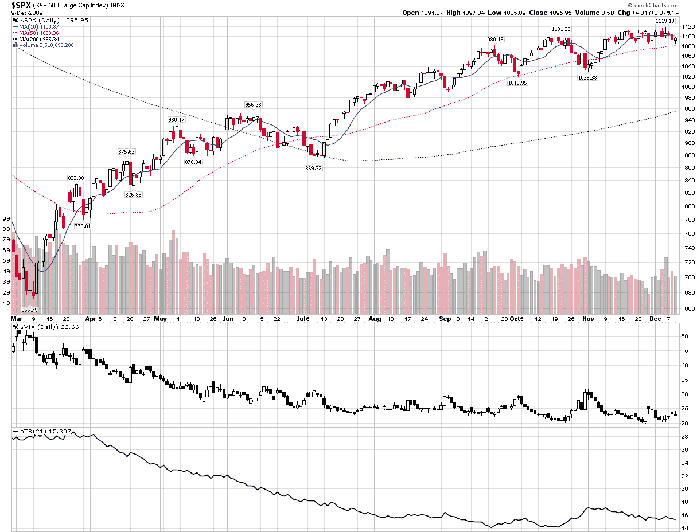

<!--yml

类别：未分类

日期：2024-05-18 17:20:33

-->

# VIX 与更多：波动性何时触底？

> 来源：[`vixandmore.blogspot.com/2009/12/when-did-volatility-bottom.html#0001-01-01`](http://vixandmore.blogspot.com/2009/12/when-did-volatility-bottom.html#0001-01-01)

如果一个投资者将宇宙视角集中在 VIX 上，那么他或她可能会合理地得出结论，就 2009 年而言，波动性在感恩节之前触底，当时 VIX 创下了本年度的日内最低点 (11/25 为 20.05) 或者在前一天，当时 VIX 创下了本年度的最低收盘价，为 20.47。

实际上，如果只考虑[历史波动性](http://vixandmore.blogspot.com/search/label/historical%20volatility)，那么在 10 天、20 天和 30 天的波动性测量中，历史波动性的低点都在九月下半月。此外，一个更全面的波动性度量指标，[真实波幅](http://vixandmore.blogspot.com/search/label/average%20true%20range) (ATR)，同样显示波动性在九月下半月触底。如下图所示，ATR 在过去一个月中并没有接近它的九月和十月的低点。另一方面，VIX 处于更加明确的下降趋势，并且在十一月继续创出新低。

这一切意味着什么？简而言之，即使波动性已经趋于平缓，市场对未来波动性的预期仍在下降。随着[假日效应](http://vixandmore.blogspot.com/search/label/Holiday%20Effect)预计从下周一开始更加明显地制约波动性，我不会感到惊讶如果 VIX 在年底之前最后一次跌至低于 20 水平。然而，在年初之后，我预计历史波动性和隐含波动率等度量指标，如 VIX，会开始更紧密地跟踪。这是否意味着历史波动性会上升至与 VIX 相遇，或者 VIX 会下降至历史波动性水平，这还有待观察。

有关相关主题的更多信息，读者们被鼓励查看：

**[来源：StockCharts]*

****披露：*** *无***
