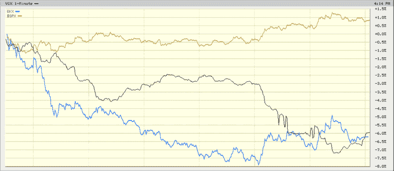

<!--yml

category: 未分类

date: 2024-05-18 18:01:52

-->

# VIX and More: 当银行和 SPX 出现背离时，VIX 应该怎么做？

> 来源：[`vixandmore.blogspot.com/2009/02/when-banks-and-spx-diverge-what-should.html#0001-01-01`](http://vixandmore.blogspot.com/2009/02/when-banks-and-spx-diverge-what-should.html#0001-01-01)

一个简单的修辞问题：VIX 应该跟踪什么，SPX 还是银行？

我提出这个问题是因为在今天的大部分时间里，标普 500 指数基本持平，而 VIX 指数下跌了数个百分点。与此同时，金融板块整体以及银行特别是在努力挣扎。正如下图所示[BKX](http://vixandmore.blogspot.com/search/label/BKX)，即 Keefe、Bruyette & Woods 银行指数，全天大部分时间下跌了 6-8%。

VIX 指数下跌了 5.4%，而银行却下跌了（-5.6%），而 SPX 上涨了（1.6%），这意味着 SPX 期权交易者并不关心银行的未来吗？我觉得这很难相信。我很想听听大家对此的评论？

*[来源：BigCharts]*
