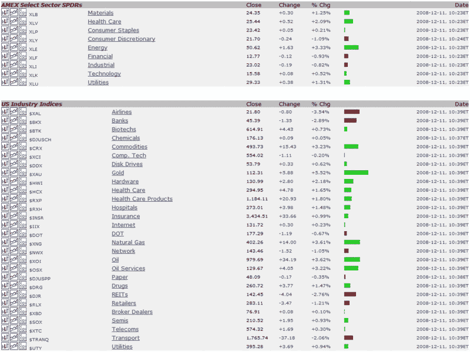

<!--yml

类别：未分类

日期：2024-05-18 18:11:29

-->

# VIX and More：这次行情的领导在哪里？

> 来源：[`vixandmore.blogspot.com/2008/12/where-is-leadership-in-this-rally.html#0001-01-01`](http://vixandmore.blogspot.com/2008/12/where-is-leadership-in-this-rally.html#0001-01-01)

过去三周以来，我对公牛表现出的信心和决心印象深刻，因为它们始终利用回调将市场淹没在新的多头头寸中。也许算法没有[恐惧](http://vixandmore.blogspot.com/search/label/fear)…

然而，最近，随着公牛阶段在[SPX 900 点附近](http://vixandmore.blogspot.com/2008/12/is-spx-going-to-stick-close-to-900.html)停滞不前，我发现自己在思考‘适当’领导力的缺乏。[昨天](http://vixandmore.blogspot.com/2008/12/strange-rally-with-gold-and-energy-up.html)和今天，商品引领了行情，黄金和能源股是表现最好的。

与此同时，我认为对复苏最为关键的三个部门，我所谓的‘[指标物种](http://vixandmore.blogspot.com/search/label/indicator%20species)’部门（金融、房地产建筑商和消费者自由选择股票）今天都未能摆脱亏损。

我不确定最终将推动 SPX 超过 1000 点的领导力将来自何处。如今，大型科技公司 First Solar ([FSLR](http://vixandmore.blogspot.com/search/label/EBAY))、苹果（[AAPL](http://vixandmore.blogspot.com/search/label/AAPL))、戴尔（[DELL](http://vixandmore.blogspot.com/search/label/DELL))、Research in Motion ([RIMM](http://vixandmore.blogspot.com/search/label/RIMM))、eBay ([EBAY](http://vixandmore.blogspot.com/search/label/EBAY)) 和英特尔（[INTC](http://vixandmore.blogspot.com/search/label/INTC)) 都表现强劲。坦率地说，我希望科技在下一轮大幅上涨中发挥重要作用，但领导力可能来自其他许多领域。

在股市中没有什么保证，但我可以保证，黄金和能源不会把 SPX 推到 1000 点以上，而将金融（[XLF](http://vixandmore.blogspot.com/search/label/XLF))、房地产建筑商（[XHB](http://vixandmore.blogspot.com/search/label/XHB)) 和消费者自由选择股票（[XLY](http://vixandmore.blogspot.com/search/label/XLY)) 抛在身后。

*[来源：StockCharts]*
