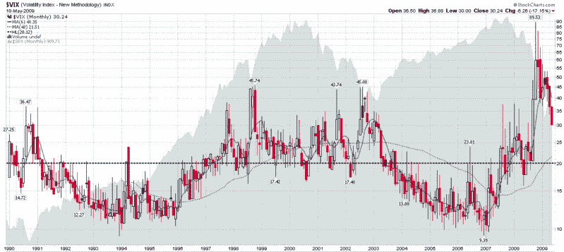

<!--yml

分类：未分类

日期：2024-05-18 17:47:00

-->

# VIX and More：VIX 将在哪里触底？

> 来源：[`vixandmore.blogspot.com/2009/05/where-will-vix-bottom.html#0001-01-01`](http://vixandmore.blogspot.com/2009/05/where-will-vix-bottom.html#0001-01-01)

我写这篇文章时，VIX 正在 28.80，此前在交易日内曾触及 28.51 的日内低点。由于这是自九月中旬以来 VIX 首次交易低于 30.00，我发现人们对 VIX 最终触底以及对股票的影响存在极大的兴趣和猜测。

在 [VIX 还能下降多少？](http://vixandmore.blogspot.com/2009/05/how-low-can-vix-go.html) 和 [新的 VIX 宏观周期图景](http://vixandmore.blogspot.com/2009/04/new-vix-macro-cycle-picture.html) 中，我预测 VIX 不太可能跌破 25-26 水平，我对此保持着这个预测。实际上，在我的 [通讯](http://vixandmoresubscriber.blogspot.com/) 中，我更为精确地表示，在过去几周中，我不预计 VIX 会在“牛市的这一阶段”下跌到 28.00 以下。老实说，目前看来，这个牛市看起来有点长了，但基于最近的价格走势，目前的阶段更像是巩固而不是逆转或即将逆转。

我已经多次提到过，在评估 VIX 时使用全套技术分析工具的危险，主要是因为没有底层资产可以买卖，考虑到 VIX 实际上只是一个计算出来的值。出于这些原因 - 并考虑到 VIX 倾向于 [均值回归](http://vixandmore.blogspot.com/search/label/mean%20reversion) - 当评估 VIX 时，我倾向于避开动量指标和振荡器，并将移动平均线和支撑位和阻力位视为一些谨慎看待的参考值。

让我花点时间来将 VIX 为 25 的历史背景放入一些历史背景中。首先，VIX 的历史平均值是 20.12（下图中的黑色虚线）。2008 年的平均 VIX，包括相对平静的四月至八月，为 32.68。回顾[1998](http://vixandmore.blogspot.com/search/label/1998)年至[2002](http://vixandmore.blogspot.com/search/label/2002)年的五年期间，这段时间包括 [长期资本管理公司](http://en.wikipedia.org/wiki/Long-Term_Capital_Management) 的灾难和 1990 年代牛市的结束，这段时间的平均 VIX 是 25.27。当前数据显示 S&P 500 的历史波动率，分别为 10、20 和 30 天的回顾期间分别为 30.88、27.24 和 30.53。

底线：25.00 是一个波动期的低数字。

VIX 可以更好地在宏观经济和地缘政治背景下进行分析，而不是以技术分析的术语来分析。最终，VIX 很少是一个恐惧指数。大多数情况下，波动性指数更准确地衡量了不确定性或投资者焦虑情绪。随着银行压力测试结果的公布，对于[结构性波动性](http://vixandmore.blogspot.com/search/label/structural%20volatility)和系统性风险的担忧现在正在消退，并被我喜欢称之为[事件波动性](http://vixandmore.blogspot.com/search/label/event%20volatility)的较低焦虑担忧所取代。当然，经济可能会再次出现重大失误，但关于全面银行国有化和 15%失业率的讨论已被新绿色发展、触底和复苏的讨论所取代。

[顺便说一句，我一直在考虑构建类似于[贝福风力等级](http://en.wikipedia.org/wiki/Beaufort_scale)的波动性等级，以便我们可以将绝对波动性度量放入更广泛的背景中。]

关于当前的波动性环境，尽管信心和流动性正在回归市场，请记住，对于许多投资者来说，金融和心理创伤仍在愈合过程中。只要事件和市场持续改善，这种愈合过程就会继续。然而，如果事件突然发生逆转，我预计会看到波动性在[回声波动性](http://vixandmore.blogspot.com/search/label/echo%20volatility)的情况下急剧上升，就像我在[我的狗能告诉我们关于波动性的事情](http://vixandmore.blogspot.com/2007/01/what-my-dog-can-tell-us-about_947.html)中描述的那样。

如果没有另一个波动性的激增，我也会预期看到波动性下降速率的戏剧性下降，因为我们开始接近波动性的底部。即使恐惧消散了，对于复苏的力度仍然存在不确定性，除了与相对市场平静时期相关的经济和市场方向的正常不确定性。

因此，历史波动性应该提供一个波动性底部，而且由于历史波动性目前无法低于 20 年代中期，我们应该很快开始看到该波动性底部的证据。我看到一些投资者呼吁流动性洪流将 VIX 推低至 20 以下。至少目前我看不到这种情况。股票有可能进入一段持续时间较长的区间交易期，将波动性降至 20 年代低位，但我会对年底看到低于 20 的 VIX 感到惊讶。

2007 年，VIX 以 22.50 的水平结束了年度。虽然我的水晶球通常不会超过一个月或两个月，但我最好的猜测是，我们在 2009 年底看到 VIX 在 22.50 到 25.00 的范围内。

*[来源：StockCharts]*
