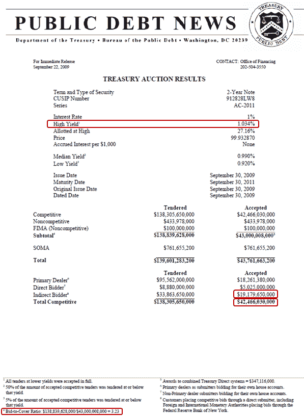

<!--yml

category: 未分类

date: 2024-05-18 17:28:49

-->

# VIX and More: 如何分析国库拍卖结果

> 来源：[`vixandmore.blogspot.com/2009/09/where-and-how-to-analyze-treasury.html#0001-01-01`](http://vixandmore.blogspot.com/2009/09/where-and-how-to-analyze-treasury.html#0001-01-01)

继[国库拍卖介绍](http://vixandmore.blogspot.com/2009/08/introduction-to-treasury-auctions.html)和[最近的国库拍卖风波](http://vixandmore.blogspot.com/2009/08/recent-treasury-auction-brouhaha.html)之后，我收到了几位读者的请求，询问如何获取相关拍卖数据以及如何计算收益率、投标倍数和间接投标者的比例。如果有一个存档的表格包含所有这些信息就好了，但是[最近国库券拍卖结果的表格](http://www.treasurydirect.gov/RI/OFNtebnd)省略了投标倍数和间接投标者的百分比。

就我所知，任何试图获取特定债券拍卖历史的人都需要手动完成。我将快速介绍如何完成此操作。首先，在页面标题为[Treasury Marketable Security Offering Announcement Press Releases](http://www.treasurydirect.gov/instit/annceresult/press/press_secannpr.htm)的 *按证券类型搜索* 列表中选择特定证券。选择[2-Year Notes](http://www.treasurydirect.gov/instit/annceresult/press/preanre/preanre_2yr.htm)会显示一个按日历年分组的所有数据页面。点击 2009 年会进入[2009 Treasury Security Auction Press Releases: 2-Year Notes](http://www.treasurydirect.gov/instit/annceresult/press/preanre/2009/2009_2year.htm)。在此页面上，每个拍卖日期都有三行与之相关联：公告；初步非竞争结果；以及拍卖结果。

通过选择[9/22 拍卖结果](http://www.treasurydirect.gov/instit/annceresult/press/preanre/2009/R_20090922_3.pdf)的 PDF 版本，我可以查看今天的拍卖数据。要关注的收益率是 *最高收益率*，今天的拍卖为 1.034%。在左下角的最底部，新闻稿注明了 3.23 的投标倍数，并提供了分子和分母的源数据。最后，间接投标者的比例没有在新闻稿中计算，但可以通过将间接投标者-接受数除以总竞争性-接受数来轻松计算。今天，这转化为 45.2% 的间接投标者百分比。

当然，分析数据的最佳方式是观察市场对价格和收益率的反应，不仅仅针对特定债券，还包括整个收益率曲线。在评估投标倍数和间接投标者的比例时，分析师倾向于将当前拍卖与相同证券的最近一次拍卖以及该证券过去 10-12 次拍卖的平均值进行比较。

对于两个专注于债券的博客，我继续推荐：

*[来源：TreasuryDirect]*
