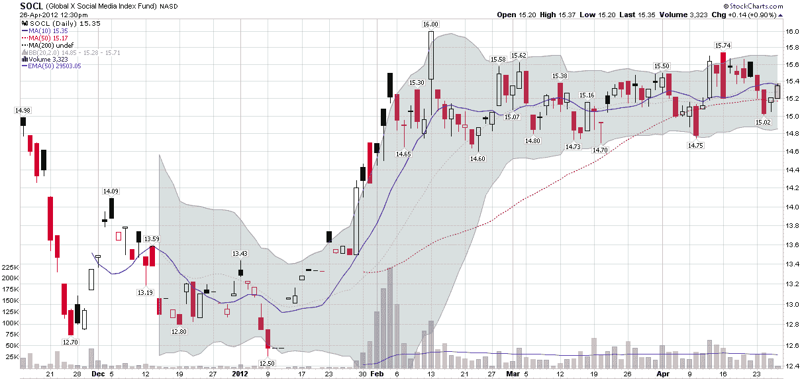

<!--yml

category: 未分类

date: 2024-05-18 16:31:51

-->

# VIX and More: 社交媒体股票何去何从？

> 来源：[`vixandmore.blogspot.com/2012/04/whither-social-media-stocks.html#0001-01-01`](http://vixandmore.blogspot.com/2012/04/whither-social-media-stocks.html#0001-01-01)

在 2007 年的 10 月，我感觉到股市有点过热，于是我创造了一个我称之为[OHFdex](http://vixandmore.blogspot.com/search/label/OHFdex)的东西，最初它是一个“过熟高飞者的观察名单”，很快演变成了一个旨在跟踪 14 只这样的股票的指数。当市场下跌时，这些股票遭到了猛烈的打击，其中包括 CROCS（[CROX](http://vixandmore.blogspot.com/search/label/CROX)）、拉斯维加斯金沙集团（[LVS](http://vixandmore.blogspot.com/search/label/LVS)）、DryShips（[DRYS](http://vixandmore.blogspot.com/search/label/DRY)）等公司的一些[惊人的崩溃](http://vixandmore.blogspot.com/2008/10/ohfdex-one-year-later.html)。

随着股票继续上涨，我考虑重新启动 OHFdex，但直到最近我还没有找到足够的理由这样做。社交媒体股票的崛起以及一些相关估值是我重新考虑 OHFdex 的原因。显然，在这一领域会有赢家也会有输家，但是领英（[LNKD](http://vixandmore.blogspot.com/search/label/LNKD)）、Groupon（[GRPN](http://vixandmore.blogspot.com/search/label/GRPN)）、Zynga（[ZNGA](http://vixandmore.blogspot.com/search/label/ZNGA)）、Pandora（[P](http://vixandmore.blogspot.com/search/label/P)）、Yelp（[YELP](http://vixandmore.blogspot.com/search/label/YELP)）、安吉斯清单（[ANGI](http://vixandmore.blogspot.com/search/label/ANGI)）、Jive Software（[JIVE](http://vixandmore.blogspot.com/search/label/JIVE)）等公司相对较高的估值引起了我的注意，甚至社交媒体 ETF 的推出（[SOCL](http://vixandmore.blogspot.com/search/label/SOCL)，[持股](http://globalxfunds.com/fundholdings.php?fundid=20164&catid=27)）也足以让我停下来思考。问题在于我很难从这一组中挑选出大赢家，尤其是在考虑到当前市值的情况下。诱惑是将它们全部做空，但至少目前，是时候将这些股票和类似的对手，如[RENN](http://vixandmore.blogspot.com/search/label/RENN)、[YOKU](http://vixandmore.blogspot.com/search/label/YOKU)、[SOHU](http://vixandmore.blogspot.com/search/label/SOHU)、[REDF](http://vixandmore.blogspot.com/search/label/REDF)、[DMD](http://vixandmore.blogspot.com/search/label/DMD)、[FFN](http://vixandmore.blogspot.com/search/label/FFN)等，放入一个社交媒体 OHFdex 中，看看事情会如何发展。

我不是说这是 2007 年 10 月或技术媒体泡沫 2.0，但每个煤矿至少需要一只金丝雀。

顺便说一句，虽然我对社交媒体作为一个整体的前景持保留态度，但我在技术硬件和软件方面一直处于技术前沿，并且与传统保守派相去甚远。我在 80 年代就开始上网，至少在两年前就开始在飞机上使用笔记本电脑，比任何人都早使用美国机器人公司的产品“Palm Pilot”，1996 年购买了我的第一台数码相机，在 Facebook 还只存在于两所大学内时就已经在上面注册了账号，并且有时候觉得自己的生活太多被迫成为意外的测试人员。

话虽如此，虽然玩弄可能是下一个科技浪潮的 v0.9 很有趣，但我不建议购买太多基于新兴技术的 v0.9 股票，尤其是那些基于新兴技术的股票。

最后，如果你对做空这些股票有兴趣，却找不到任何可供做空的股票，考虑购买期权、卖出认购期权或同时进行两者以创建[合成](http://vixandmore.blogspot.com/search/label/synthetic)做空头寸。

相关文章：

**

*[来源：StockCharts.com]*

***声明：*** *在撰写本文时做空 GRPN、ZNGA、P 和 YELP*
