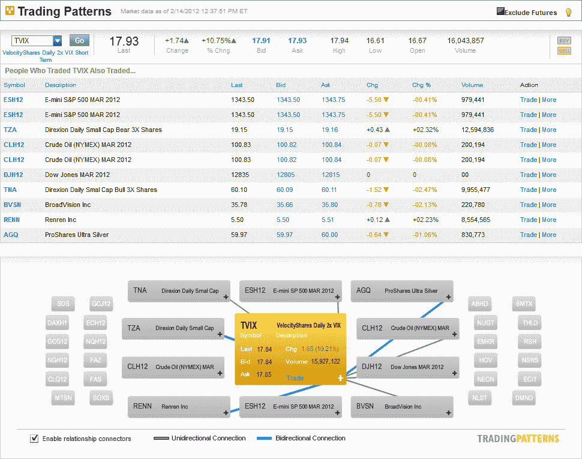

<!--yml

category: 未分类

date: 2024-05-18 16:40:11

-->

# VIX and More：谁在交易 TVIX？

> 来源：[`vixandmore.blogspot.com/2012/02/who-is-trading-tvix.html#0001-01-01`](http://vixandmore.blogspot.com/2012/02/who-is-trading-tvix.html#0001-01-01)

随着今天[TVIX](http://vixandmore.blogspot.com/search/label/TVIX)的交易再次升温（交易量增长 21%，达到 2100 万股），我考虑了一下谁可能在交易我一年多前在这里称之为“日内交易火箭燃料”的东西。

幸运的是，我们有 optionsXpress 的[交易模式](http://vixandmore.blogspot.com/search/label/Trading%20Patterns)功能来帮助回答这个问题。

在下面的图中，TVIX 似乎是那些喜欢高波动性产品的人的武器之一，这些产品非常适合短期交易。这些产品包括 [3x 杠杆 ETPs](http://vixandmore.blogspot.com/search/label/triple%20ETFs)（[TNA](http://vixandmore.blogspot.com/search/label/TNA) 和 [TZA](http://vixandmore.blogspot.com/search/label/TZA)）、白银的 2x 杠杆 ETP（[AGQ](http://vixandmore.blogspot.com/search/label/AGQ)）以及基于标普 500、道琼斯工业平均指数和 [原油](http://vixandmore.blogspot.com/search/label/crude%20oil) 的一些期货产品。还有两只高飞的股票，人人网（[RENN](http://vixandmore.blogspot.com/search/label/RENN)）和 BroadVision（[BVSN](http://vixandmore.blogspot.com/search/label/BVSN)）-后者恰好是我在 16 年前购买的第一只或第二只互联网股票。

看起来我打字的速度跟不上市场事件。当我正在打这个字时，TVIX 似乎出现了另一次空头挤压（详情请见[VXX Options Calm After Second Highest Volume Day Ever](http://vixandmore.blogspot.com/2012/02/vxx-options-calm-after-second-highest.html)），不过市场似乎又开始平静下来了。

最后，快速提醒一下，今天是 VIX 二月期权的最后交易日。VIX 二月期货可以在明天的盘前交易时段进行交易，时段为美国东部时间上午 8:00 - 9:15。这两种产品在明天的正式交易时段开始时都将以特殊的开盘行情（[VIX SOQ](http://vixandmore.blogspot.com/search/label/VIX%20SOQ)）结算。

相关文章：

**

*[来源：optionsXpress.com]*

***Disclosure(s):*** *short VXX and TVIX at time of writing*
