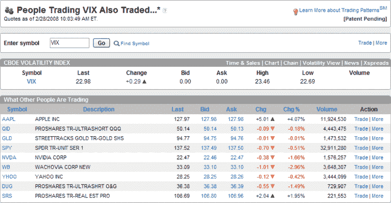
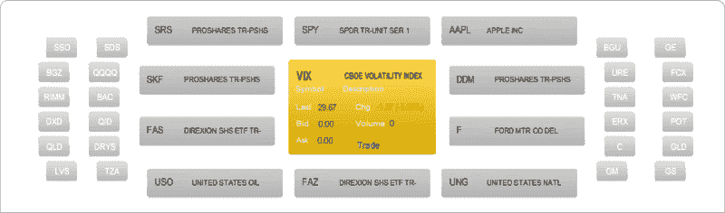
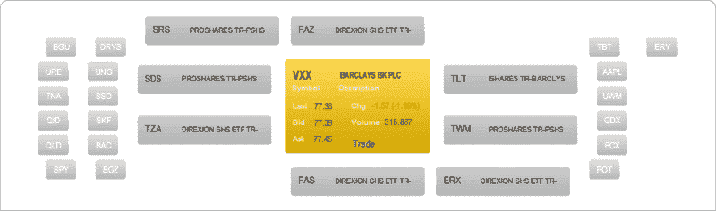

<!--yml

category: 未分类

date: 2024-05-18 17:42:13

-->

# VIX and More: Who Trades the VIX and VXX?

> 来源：[`vixandmore.blogspot.com/2009/06/who-trades-vix-and-vxx.html#0001-01-01`](http://vixandmore.blogspot.com/2009/06/who-trades-vix-and-vxx.html#0001-01-01)

在过去的几次中，我曾在 optionsXpress 的[交易模式](http://vixandmore.blogspot.com/search/label/Trading%20Patterns)功能上玩得很开心，包括 2008 年 2 月的一篇[optionsXpress 交易模式与 VIX](http://vixandmore.blogspot.com/2008/02/optionsxpress-trading-patterns-and-vix.html)文章，其中梳理了那些交易 VIX 的 optionsXpress 客户还在交易的证券。

综合考虑过去 16 个月发生的一切，我觉得看看现在的 VIX 交易者在交易什么可能会很有趣，并且还可以将其与[VXX](http://vixandmore.blogspot.com/search/label/VXX)的交易者进行对比。

首先，2008 年 2 月 28 日的一份 VIX 交易者概览展示了对房地产、科技和石油的反向杠杆头寸。

我扩展了今天的 VIX 交易者概览，包括了更大的证券名单。显然，一些主题依然存在，例如对房地产和金融的反向杠杆头寸偏好，以及对一些最具波动性的势头股票交易的兴趣。

最后，观察 VXX 交易者，ETF 以及特别是杠杆 ETF 交易在更加重要的交易策略中起到更加重要的作用。

关于结论，我知道 optionsXpress 客户群是广泛交易人群的零售定向子集，不一定代表 VIX 和 VXX 交易的大部分交易量。然而，从上面的图形可以看出，很难证明交易者在使用 VIX 和 VXX 进行[对冲](http://vixandmore.blogspot.com/search/label/hedging)。根据可用数据，交易 VIX 和 VXX 的交易者通常交易市场上最具波动性的杠杆证券。至少，在那些更倾向于关注最具波动性的核心交易品种的交易者中，VIX 和杠杆 ETF 之间的联系似乎非常紧密。

*[来源：optionsXpress]*

***披露****：本文撰写时持有 VXX 多头和 VIX 中性头寸*
