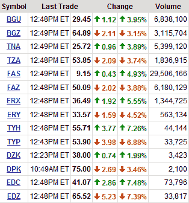

<!--yml

分类：未分类

日期：2024-05-18 18:01:41

-->

# VIX and More：为什么 Directon 最新的 ETF 成交量那么少？

> 来源：[`vixandmore.blogspot.com/2009/02/why-is-there-so-little-volume-in-most.html#0001-01-01`](http://vixandmore.blogspot.com/2009/02/why-is-there-so-little-volume-in-most.html#0001-01-01)

看起来，我认识的每一个日间交易员都沉迷于[Directon](http://vixandmore.blogspot.com/search/label/Direxion) [三重 ETF](http://vixandmore.blogspot.com/search/label/triple%20ETFs)的杠杆火力之下。 奇怪的是，只有在 11 月推出的第一批 ETF 才火了起来。 这些包括熟悉的代号如[FAS](http://vixandmore.blogspot.com/search/label/FAS)、[FAZ](http://vixandmore.blogspot.com/search/label/FAZ)、[TNA](http://vixandmore.blogspot.com/search/label/TNA)、[TZA](http://vixandmore.blogspot.com/search/label/TZA)、[BGU](http://vixandmore.blogspot.com/search/label/BGU)、[BGZ](http://vixandmore.blogspot.com/search/label/BGZ)、[ERX](http://vixandmore.blogspot.com/search/label/ERX)和[ERY](http://vixandmore.blogspot.com/search/label/ERY)。

我讨论的最新一批 ETF，见[Directon 三重 ETF 增加新的赛马](http://vixandmore.blogspot.com/2009/01/direxion-triple-etfs-add-new-horses-to.html)，吸引力明显较低。 尽管它们是在十二月底推出的，但只有其中的两款 ETF，[EDC](http://vixandmore.blogspot.com/search/label/EDC)和[TYH](http://vixandmore.blogspot.com/search/label/TYH)，超过了每日 100,000 的成交量标志，而 TYH 仅仅触及了这一标志，成交量最高达到了 101,900。 在下面的图表中，可以看到在今天交易日过半的时候拍摄的快照中，这六只新 ETF 正陷入困境。

果汁并不是问题，因为新兴市场（EDC 和[EDZ](http://vixandmore.blogspot.com/search/label/EDZ)）和科技（TYH 和[TYP](http://vixandmore.blogspot.com/search/label/TYP)）始终是市场中最波动的部分之一。

[昨天的半反问问题](http://vixandmore.blogspot.com/2009/02/when-banks-and-spx-diverge-what-should.html)上的评论很出色。 让我们看看集体智慧能够提出什么样的解释。

*[来源：Yahoo]*
