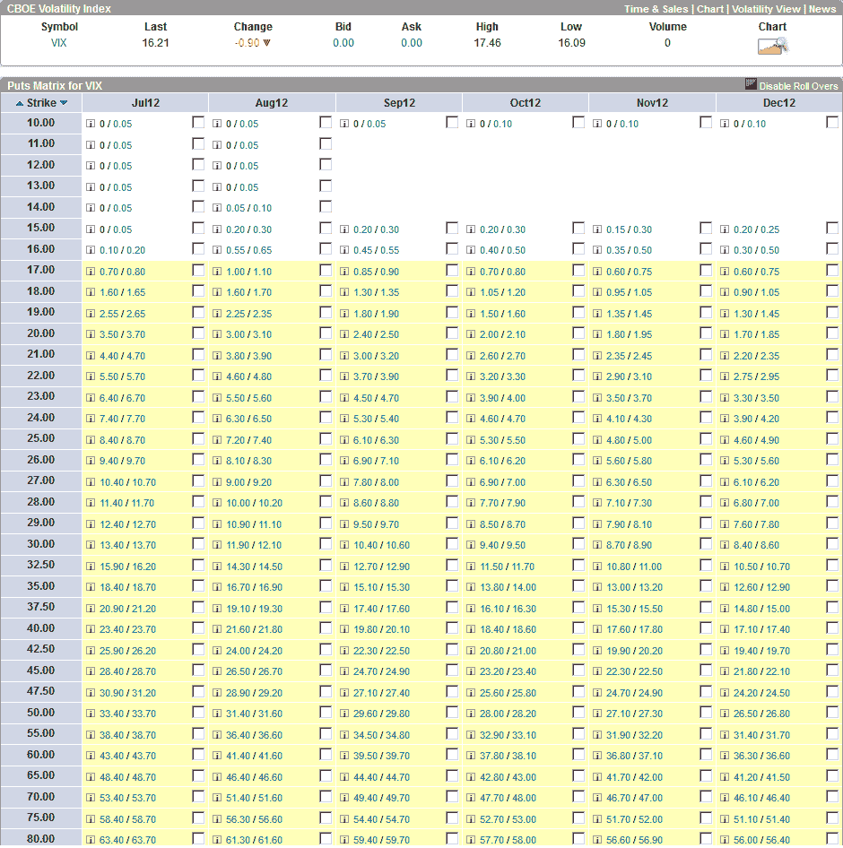

<!--yml

类别：未分类

日期：2024-05-18 16:26:06

-->

# VIX and More：为什么 VIX 看跌期权在更遥远的月份会变得更便宜

> 来源：[`vixandmore.blogspot.com/2012/07/why-vix-puts-get-cheaper-in-more.html#0001-01-01`](http://vixandmore.blogspot.com/2012/07/why-vix-puts-get-cheaper-in-more.html#0001-01-01)

今天我接到了几个与 VIX 看跌期权估值相关的问题——即使对于经验丰富的投资者来说，这也是一个令人头疼的主题。

下面的看跌期权矩阵图表，由[optionsXpress](http://www.optionsxpress.com/)提供，显示了从七月份（明天开盘到期）到十二月份的 VIX 看跌期权的买卖报价。

在这次截屏时 VIX 为 16.21 时，请注意，对于 17 看跌期权，从八月到十二月的价格已经考虑了一些均值回归。因此，八月份的 17 看跌期权是板上最贵的，买卖中点为 1.05。九月份的 17 看跌期权报价为 0.875；十月份的为 0.75；十一月和十二月的都为 0.675。

解读这个看跌期权矩阵的一种方式是，如果你选择除了当前月份以外的任何一个月份，那么 VIX 很可能会在 17 以下收盘，那么八月份就是你的月份。此外，如果你期望出售 VIX 17 看跌期权能得到任何钱，那么八月份是最好的目标月份。这是因为 VIX 期权的价值性考虑了整个 VIX 期限结构，并且随着 VIX 期货处于陡峭的升水状态，后期相比于前期（七月份）的 VIX 期货高出整整九个点。

*[另外，当尝试使用 VIX 看跌期权构建日历价差时，情况变得更加疯狂。事实上，最好的方式是不将这些交易视为基于一个标的的价差，而是基于两个不同标的的两笔不同交易：每个对应月份的[VIX 期货](http://vixandmore.blogspot.com/search/label/VIX%20futures)。这个主题的细节是另一篇文章的素材。]*

最后，对于那些考虑卖出 VIX 看跌期权的人来说——总是一个有趣的策略，但往往涉及的保费很少——要考虑的关键风险管理概念是，VIX 暴涨的方向几乎总是向上，而极少向下。除了 QE3 的宣布，很难预测哪种类型的新闻会将 VIX 推低到 15.00 以下，并保持一段时间。

关于 VIX 看跌期权矩阵、VIX 看跌期权定价以及一些战略含义的更多信息，请查看下面的一些链接。

相关帖子：

**

*[来源：optionsXpress.com]*

***披露：*** *在撰写时持有 VIX 多头；optionsXpress 是 VIX and More 的广告商*
