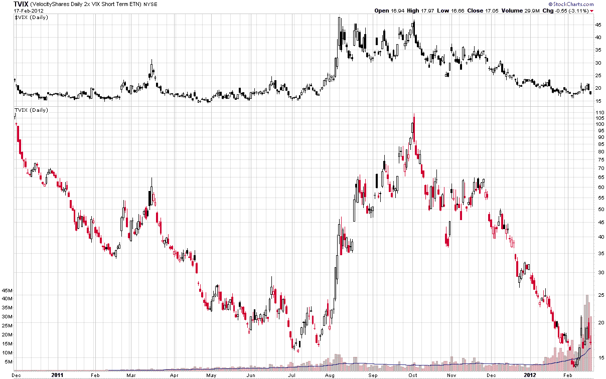

<!--yml

category: 未分类

date: 2024-05-18 16:39:32

-->

# VIX 和更多：TVIX 会归零吗？

> 来源：[`vixandmore.blogspot.com/2012/02/will-tvix-go-to-zero.html#0001-01-01`](http://vixandmore.blogspot.com/2012/02/will-tvix-go-to-zero.html#0001-01-01)

对于 [TVIX](http://vixandmore.blogspot.com/search/label/TVIX)（VelocityShares 每日 2 倍 VIX 短期 ETN）的突然兴趣激增，使其成为上周五最活跃的 [VIX 交易产品](http://vixandmore.blogspot.com/search/label/VIX%20ETN)（ETP），而 TVIX 则超越了前任的王者[VXX](http://vixandmore.blogspot.com/search/label/VXX)。

TVIX 的吸引力部分来自于零售投资者，他们在过去一两周内以令人惊讶的速度接受了这个产品。 TVIX 的吸引力部分是由于其波动性：这是一个产品，从去年 8 月的 15 跃升至 10 月初的 109 多，然后在本月早些时候跌至 13 以下。根据我收到的一些问题，很明显许多新投资者不理解他们正在交易的产品。

首先，对于那些对 TVIX 还不熟悉的人，请确保了解什么是 VXX，为什么它在过去三年表现不佳，以及它作为短期和长期投资的缺点。大部分情况下，TVIX 相当于 VXX，但具有 2 倍的杠杆。 *[如果您从下面的链接底部开始阅读，并继续向上阅读，有关 VXX 的关键点应该很快就会显现出来。]*

我时不时收到关于 TVIX，VXX 和其他一些 VIX ETP 是否“被设计为归零”的询问。事实并非如此。实际上，对于那些希望从短期波动增加中受益的人来说，TVIX 和 VXX 可能是优秀的产品。重要的是要注意，这些产品仅设计为短期交易工具，预计它们将比零售投资者对机构投资者更具吸引力。

不幸的是，在长期时间范围内，TVIX，VXX 和许多其他 VIX ETP 的多头头寸将是一种亏损的投资。对于那些怀疑的人，阅读 [TVIX 的招股说明书](http://www.velocityshares.com/pdf/VelocityShares.ETN.Final.Pricing.Supplement.VIXlong.pdf)。从 PS-26 页的风险因素讨论开始，并确保一直阅读到 PS-28 的第一段落，您将遇到以下声明：

> *“你的 ETN 的长期预期价值为零。如果您将 ETN 作为长期投资持有，那么您很可能会失去全部或大部分投资。”*

这就是情况的概况，并有助于解释为什么 TVIX 自 2010 年 11 月底推出以来下跌超过 80%，尽管去年 7 月至 10 月之间急剧上升了 7 倍。TVIX 会归零吗？不会。与其他一些 VIX ETPs 一样，如果 TVIX 继续下跌，可能会使用逆向拆分来增加股价。

明天我将深入探讨 TVIX 价格的四个关键驱动因素以及它们对短期交易者和长期投资者的影响。

相关帖子：

**

*[来源：StockCharts.com]*

***披露：*** *撰写时空仓 VXX 和 TVIX*
