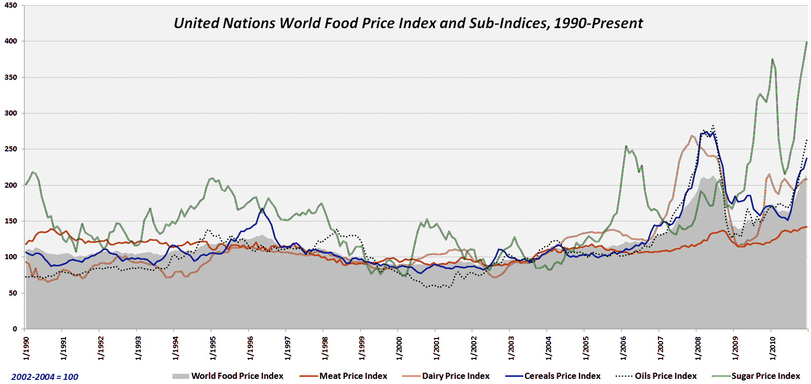

<!--yml

类别：未分类

日期：2024-05-18 16:54:26

-->

# VIX and More：世界食品子指数价格

> 来源：[`vixandmore.blogspot.com/2011/01/world-food-sub-index-prices.html#0001-01-01`](http://vixandmore.blogspot.com/2011/01/world-food-sub-index-prices.html#0001-01-01)

有时我真不知道何时放手，特别是当涉及将每一个可能相关的数据塞进一个过于拥挤的图表时。

昨天的[本周图表：世界食品价格](http://vixandmore.blogspot.com/2011/01/chart-of-week-world-food-prices.html)是一个相对简洁的图表示例，试图以相对清晰简洁的方式阐明一两个简单观点。经过与几位读者的来回讨论，我选择了破坏这种简单，并公布了一个添加了五个子指数的图表：肉类；奶制品；谷物；油类和糖。结果如下，我已附在下方，显示了世界食品价格中真正的变数是糖，该图表以绿色线表示。在较小程度上，谷物、奶制品和油类也曾出现过极端价格波动。五个子组别中最不易受波动影响的是肉类。

对于那些希望超越期货，寻找能够复制一些这些[大宗商品](http://vixandmore.blogspot.com/search/label/commodities)子指数的 ETP 的人来说，有许多广泛的农业 ETF，涵盖了大多数或全部的子指数。流行的 PowerShares DB 农业基金（[DBA](http://vixandmore.blogspot.com/search/label/DBA)）是该群体中最流动的。DBA 的替代品包括[RJA](http://vixandmore.blogspot.com/search/label/RJA)、[JJA](http://vixandmore.blogspot.com/search/label/JJA)、[FUD](http://vixandmore.blogspot.com/search/label/FUD)和[UAG](http://vixandmore.blogspot.com/search/label/UAG)。对于希望针对谷物的投资者，值得调查的有[JJG](http://vixandmore.blogspot.com/search/label/JJG)和[GRU](http://vixandmore.blogspot.com/search/label/GRU)，以及玉米特定的 ETP，[CORN](http://vixandmore.blogspot.com/search/label/CORN)。对于糖子指数，[SGG](http://vixandmore.blogspot.com/search/label/SGG)是一个很好的选择。[JJS](http://vixandmore.blogspot.com/search/label/JJS)是一个‘软件’领域的 ETP，几乎等权重分布在咖啡、棉花和糖之间。最后，[COW](http://vixandmore.blogspot.com/search/label/COW)和[UBC](http://vixandmore.blogspot.com/search/label/UBC)都是肉类子指数的潜在替代品。

相关文章：

*[来源：联合国]*

***披露：*** *写作时持有玉米（CORN）和糖（SGG）头寸*
