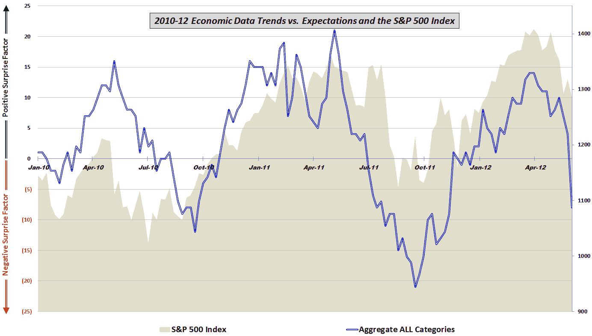

<!--yml

类别：未分类

日期：2024-05-18 16:29:13

-->

# VIX and More：相对于预期来说，自 2009 年以来经济数据最糟糕的一周

> 来源：[`vixandmore.blogspot.com/2012/06/worst-post-2009-week-in-economic-data.html#0001-01-01`](http://vixandmore.blogspot.com/2012/06/worst-post-2009-week-in-economic-data.html#0001-01-01)

本周创下了有史以来最糟糕的一周经济数据相对于预期的记录-至少在我收集这些数据并进行我的专有分析的 2 年半里是如此。

我最近在[股票和经济数据强劲增长，尽管制造业和房地产数据令人失望](http://vixandmore.blogspot.com/2012/04/stocks-and-economic-data-on-upswing.html)中报告了我的经济数据分析与预期的对比。当时，我对我注意到的制造业和[房地产](http://vixandmore.blogspot.com/search/label/housing)数据的相对疲软表示关注：

> *“在 2010 年和 2011 年，制造业和一般经济数据的积极意外结束与股市的熊市下跌相一致。到目前为止，2012 年的制造业和一般经济数据的失望还没有能够对股市的上涨造成影响。我感觉到这些数据和股市将在下个月朝着同一个方向发展。这意味着数据上升还是股市下跌，尚不清楚。”*

通过今天的[就业](http://vixandmore.blogspot.com/search/label/employment)报告、[ISM](http://vixandmore.blogspot.com/search/label/ISM)制造业指数和建筑数据，我们可以得知，目前的疲软已不再局限于制造业和房地产，而且也拖累了就业、消费支出以及消费者信心。

下图显示了自 2010 年初以来的所有类别的综合数据情况。值得一提的是，唯一一次数据相对预期如此糟糕的一周是在 2011 年 2 月中旬，那时数据正在从历史最高水平回落，大约在数据和股票达到顶峰并开始下跌约 2 个半月前。

这一次的情况显然大不相同，但请记住，过去六个月左右，股票与就业数据的相关性要高于其他任何经济活动指标。

*[对于对本图形中包含的组成数据和所使用的方法感兴趣的读者，鼓励查看以下链接。对于想要了解我综合数据计算中的具体经济数据发布的更多详细信息的人，请查看* [*本周经济数据图表（2010 年）*](http://vixandmore.blogspot.com/2011/01/chart-of-week-year-in-economic-data.html)*。]*

相关文章：

**

*[来源：各种]*

***披露：*** *无*
