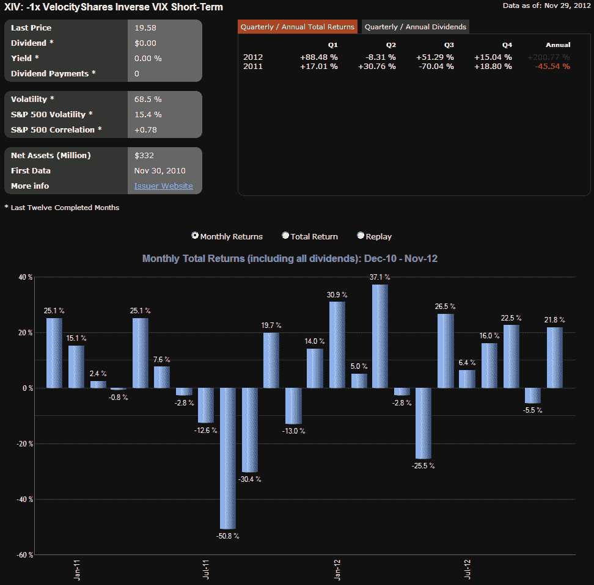
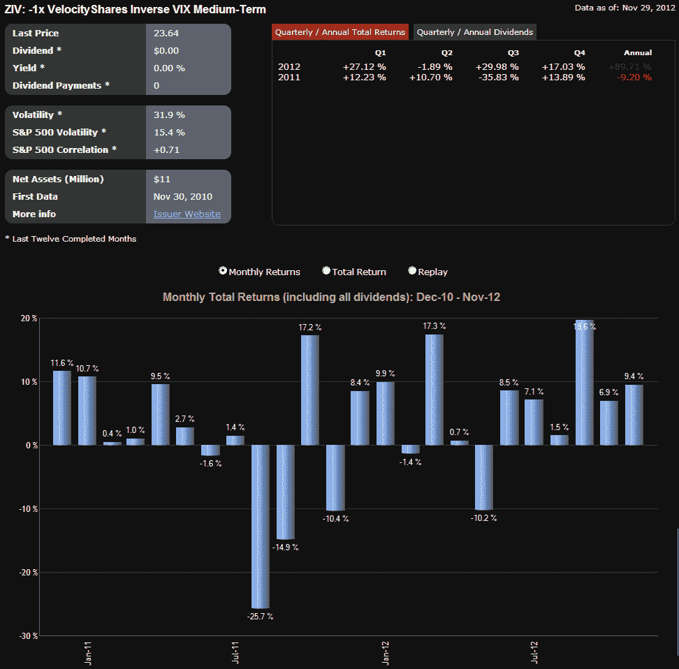

<!--yml

分类：未分类

日期：2024-05-18 16:22:14

-->

# VIX 与更多：XIV 和 ZIV 在推出两年后取得巨大成功

> 来源：[`vixandmore.blogspot.com/2012/11/xiv-and-ziv-are-huge-success-stories.html#0001-01-01`](http://vixandmore.blogspot.com/2012/11/xiv-and-ziv-are-huge-success-stories.html#0001-01-01)

两年前的今天，VelocityShares 推出了他们的六种[VIX-based exchange-traded products](http://vixandmore.blogspot.com/search/label/VIX%20ETN)，我相当确定我是唯一在推出当天就报道了该事件的人：[VelocityShares 推出六种新的波动性 ETN 令人印象深刻](http://vixandmore.blogspot.com/2010/11/impressive-launch-for-sextet-of-new.html)。

两年后，其中一个产品，VelocityShares 日内反向 VIX 短期 ETN，([XIV](http://vixandmore.blogspot.com/search/label/XIV))，在资产和表现方面都取得了毫无保留的成功。在过去的三个月里，XIV 的日均交易量超过 1200 万股，成为仅次于[VXX](http://vixandmore.blogspot.com/search/label/VXX)的第二受欢迎的 VIX-based ETP。XIV 受欢迎的部分原因无疑是由于其表现。如下图所示，XIV 今年的涨幅超过了 200%，成为全年所有 ETPs 中表现最佳的产品。

XIV 的表现令人惊讶的地方在于它并不是很难预测的。事实上，XIV 推出不到一周，我在[Bespoke Investment Group](http://www.bespokeinvest.com/)的[第二届年度圆桌讨论](http://bespokepremium.com/roundtable/)上公布了对 XIV 的看涨预测。当被问及我 2011 年和以后的一些最喜欢的选择时，我[预测](http://bespokepremium.com/roundtable/vixandmore/)：

> *“2011 将标志着波动性作为一种资产类别的崛起。其中一个原因是 VIX-based ETNs 和 ETFs 的惊人成功，特别是最近推出的 XIV，这将证明波动性工具可以成为良好的买入持有投资。”*

和 XIV 一样，ZIV 的崛起也令人惊讶的是，关注度甚少，（VelocityShares 日内反向 VIX 中期 ETN）。ZIV 通常每天交易约 1 万股，然而自两者推出以来，该 ETP 的表现远远超过了 XIV。ZIV 不仅表现更好，而且风险要小得多。例如，2011 年，XIV 下跌了 45.54%，而 ZIV 仅损失了 9.20%。我曾认为，今年 1 月我关于[ZIV 受到不当忽视](http://vixandmore.blogspot.com/2012/01/ziv-undeservedly-neglected.html)的帖子可能会激起人们对 ZIV 的兴趣，但出于某种原因，投资者继续回避这一令人印象深刻的表现者。

VelocityShares 与 XIV 和 ZIV 一起推出的另外四种产品结果参差不齐。其中最著名的是[TVIX](http://vixandmore.blogspot.com/search/label/TVIX)，在二月份曾短暂成为[按成交量计算的最高 VIX 衍生产品](http://vixandmore.blogspot.com/2012/02/tvix-topples-vxx-as-highest-volume-vix.html)，然后瑞士信贷银行（[CS](http://vixandmore.blogspot.com/search/label/CS)）[暂停了该产品的创造单位](http://vixandmore.blogspot.com/2012/02/credit-suisse-suspends-creation-units.html)，为 ProShares Ultra VIX Short-Term Futures ETF（[UVXY](http://vixandmore.blogspot.com/search/label/UVXY)）取代 TVIX 成为最高 +2x VIX 衍生产品敞开了大门。大多数时间，[VIIX](http://vixandmore.blogspot.com/search/label/VIIX)、[VIIZ](http://vixandmore.blogspot.com/search/label/VIIZ) 和 [TVIZ](http://vixandmore.blogspot.com/search/label/TVIZ) 自推出以来一直作为小众产品运作。

展望未来，如果 XIV 和 ZIV 继续发布令人印象深刻的数据，而你还没有看过 ZIV，那么现在看也不算太晚。

相关帖子：

*[来源：ETFreplay.com]*

***披露：*** *截至撰写时，持有长期 XIV、长期 ZIV、短期 VXX 和短期 UVXY*
