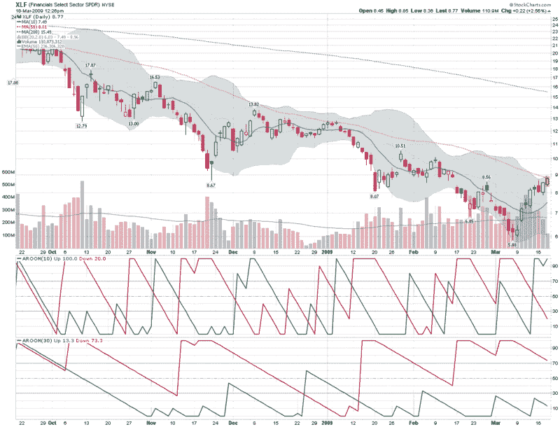

<!--yml

类别：未分类

日期：2024-05-18 17:55:01

-->

# VIX and More: XLF 偏见取决于时间框架

> 来源：[`vixandmore.blogspot.com/2009/03/xlf-bias-depends-on-time-frame.html#0001-01-01`](http://vixandmore.blogspot.com/2009/03/xlf-bias-depends-on-time-frame.html#0001-01-01)

最近，金融部门似乎就是市场。因此，我现在密切关注金融部门 SPDR ([XLF](http://vixandmore.blogspot.com/search/label/XLF))和 KBW 银行指数 ([BKX](http://vixandmore.blogspot.com/search/label/BKX)) 的每一次波动，除了一小部分金融股票在特定日子可能处于最危险的状态。

在我看来，然而，XLF 是捕捉金融领域各种活动的最佳途径，从银行和证券公司到保险公司和消费金融公司，XLF 几乎涵盖了所有领域。

下面的图表捕捉了 XLF 最近六个月的行动，并突出了当前 XLF 和更广泛市场面临的问题。股票在短期内被超买，在长期内被超卖。

与其使用振荡器显示股票的超买和超卖情况，我通常更喜欢依靠一组移动平均线和趋势强度指标，以波动率作为一个重要的次要指标。从移动平均线来看，XLF 现在远高于 10 天移动平均线，并且正在遇到 50 天移动平均线的阻力。在趋势方面，利用[Aroon](http://vixandmore.blogspot.com/search/label/Aroon)指标来衡量趋势和突破强度，从 10 天计算来看，XLF 是看涨的，但从 30 天的角度来看是看跌的。在这张图表中，在波动率方面并没有太多可以看到的内容，但是通过追踪[Bollinger Bands](http://vixandmore.blogspot.com/search/label/Bollinger%20bands)的上半部分，XLF 通常具有正面的短期动量，而接近上带则表明反转很可能即将发生。

所以你有了：看涨的动量触发了趋势跟随群体的买入，而超买指标使得摇摆交易群体准备做空。这就是目前市场的状态。你倾向的方向更有可能是你分析的[时间范围](http://vixandmore.blogspot.com/search/label/time%20horizon)的一个函数，而不是任何其他技术因素。

*[来源：StockCharts]*

****披露****：撰写时空仓 XLF。**
