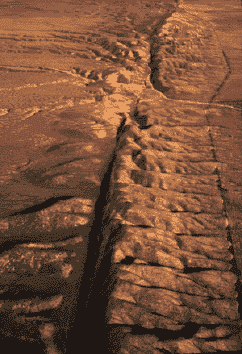

<!--yml

category: 未分类

date: 2024-05-18 18:39:50

-->

# VIX and More: 昨天不寻常的 VIX 和 SPX 波动

> 来源：[`vixandmore.blogspot.com/2008/03/yesterdays-unusual-vix-and-spx-action.html#0001-01-01`](http://vixandmore.blogspot.com/2008/03/yesterdays-unusual-vix-and-spx-action.html#0001-01-01)

正如我昨天在[VIX Follows Markets Down in Early Trading](http://vixandmore.blogspot.com/2008/03/vix-follows-markets-down-in-early.html)中提到的，当标普 500 指数下跌时，VIX 很少下跌，而当 SPX 下跌 1％或更多时，VIX 下跌更罕见。 事实上，当 SPX 昨天收盘下跌 1.15％时，VIX 当天下跌 0.77％，自 2003 年 4 月以来，这是 VIX 第二次在 SPX 失去超过 1％的日子放弃地盘。

回顾自 1990 年以来 VIX 在 SPX 下跌 1％的同时下跌的所有 22 次情况，得出一个有趣的数据分布。 前 10 次情况聚集在 1990 年和 1991 年初，并与[海湾战争](http://en.wikipedia.org/wiki/Gulf_War)前的所有不确定性有关。 经过九年的中断-著名的 1990 年代牛市-数据的下一个聚集由 2000 年 5 月至 2003 年 4 月的十个情况组成，大致由[互联网泡沫](http://en.wikipedia.org/wiki/Dot_com_bubble)的破裂开始到市场开始确认以一系列新高点作为底部的时刻。

VIX 下跌并伴随着 SPX 下跌 1％或更多的情况最近的例子来自 2005 年 1 月 4 日，这在很大程度上是与 9.3 级[印度洋地震](http://en.wikipedia.org/wiki/2004_Indian_Ocean_earthquake)相关的后果。 这是有史以来第二次大地震（至少在地震图上记录）并且与随后的海啸一起，导致了超过 20 万人死亡。

尚待观察是否构造性力量导致了昨天不寻常的 VIX 和 SPX 波动。 历史表明，这些日子可以发生在熊市的开始或结束。 虽然 SPX 通常在 SPX 下跌 1％伴随负面 VIX 后的几周内表现优于历史规范，但历史也表明，从像昨天这样的日子得出的更安全的结论是未来会有增加的波动性。
