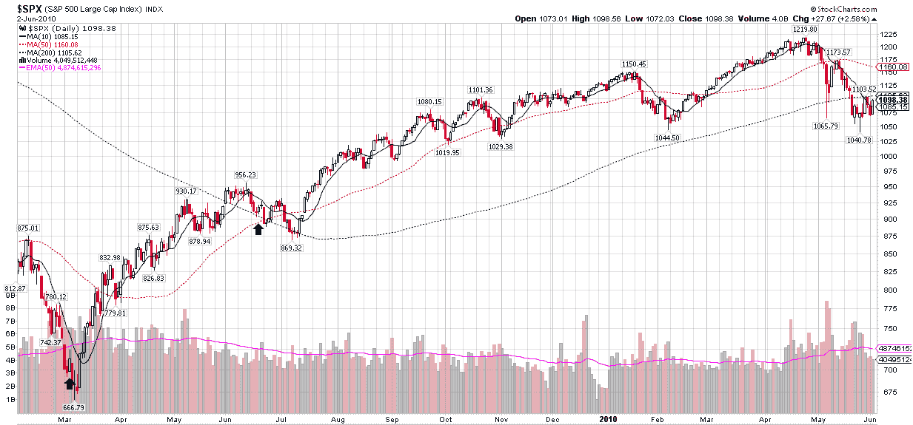

<!--yml

类别：未分类

日期：2024-05-18 17:08:55

-->

# VIX 和更多：昨天不寻常的低 ISEE 股票数字

> 来源：[`vixandmore.blogspot.com/2010/06/yesterdays-unusually-low-isee-equity.html#0001-01-01`](http://vixandmore.blogspot.com/2010/06/yesterdays-unusually-low-isee-equity.html#0001-01-01)

昨天的 [ISEE](http://vixandmore.blogspot.com/search/label/ISEE) 仅股票收盘价为 100，这是过去一年中仅有的一次更低的数字。

请记住，ISEE 是一个看涨看跌比率（或更常见的 [看跌看涨比率](http://vixandmore.blogspot.com/search/label/put%20to%20call) 的倒置版本），而仅包含股票的变体可能是利用零售期权交易者的期权习惯的最佳方法。

下面的图表追溯到 2009 年 2 月，用绿色箭头突出显示了仅有的两个 ISEE 股票指数低于 100 时的情况。请注意，这两个情况都发生在一个重要底部之前。

在当前情况下，低 ISEE 股票仅出现数字，可能是一个重要底部之后出现的事实，提出了两种截然不同的可能性：

1.  SPX 1040 可能不会成为底部...或者

1.  SPX 1040 有很大的机会保持，因为许多投资者仍然坚定地站在空头阵营，并且还没有转向多头

关于我目前倾向的第二种选择背后的理由，[检查无神论者](http://vixandmore.blogspot.com/2008/01/checking-for-atheists.html)（以及下面链接的一些其他帖子）可能会引起兴趣。

关于相关主题的更多信息，请鼓励读者查看：

*[来源：StockCharts.com]*

***披露：*** *无*
