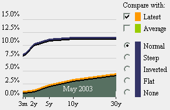

<!--yml

category: 未分类

date: 2024-05-18 18:37:15

-->

# VIX and More: Yield Curve Looks Just Like May 2003

> 来源：[`vixandmore.blogspot.com/2008/04/yield-curve-looks-just-like-may-2003.html#0001-01-01`](http://vixandmore.blogspot.com/2008/04/yield-curve-looks-just-like-may-2003.html#0001-01-01)

在网络上有几个地方可以观看一个短暂的时间跨度视频，展示了收益率曲线的最近历史。其中一个地方是 Fidelity 的[历史收益率曲线](http://fixedincome.fidelity.com/fi/FIHistoricalYield)页面。

在 Fidelity 网站上回顾收益率曲线的历史时，我惊讶地发现当前的收益率曲线几乎与 2003 年 5 月的曲线完全相同。这可能只是一个历史巧合，但 2003 年 5 月也代表了 2002-2003 年底之后持续五年的牛市的开始。在下面的图表中，我添加了一个蓝色箭头标记 2003 年 5 月，这恰好是 SPX 开始创造更高的高点并确认牛市正在进行的时间。

回顾一下，从 2006 年开始的倒挂收益率曲线引起了投资者的极大忧虑，后来证明它是一个出色的——尽管有点早——预示着即将到来的股市顶部和随后的经济困境的预测器。从历史上看，像目前这样的陡峭收益率曲线，以及我们在 2003 年 5 月看到的曲线，通常是更好时光的先驱，并且经常出现在经济扩张的开端。
