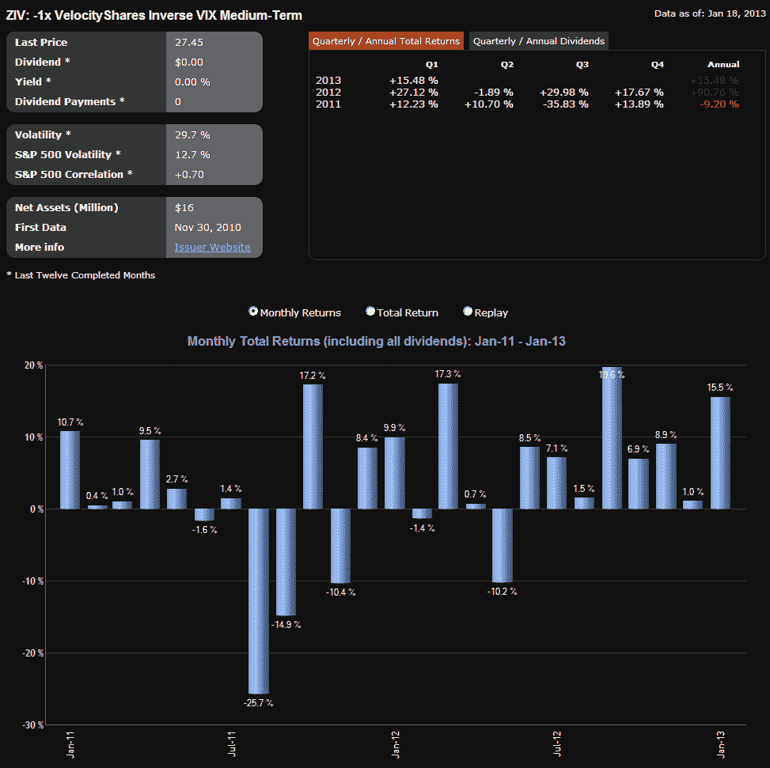

<!--yml

分类：未分类

日期：2024 年 05 月 18 日 16:19:03

-->

# VIX 与更多：ZIV 开始获得动力

> 来源：[`vixandmore.blogspot.com/2013/01/ziv-starting-to-gain-momentum.html#0001-01-01`](http://vixandmore.blogspot.com/2013/01/ziv-starting-to-gain-momentum.html#0001-01-01)

一年前，我写了[ZIV 不应被忽视](http://vixandmore.blogspot.com/2013/01/vix-etp-performance-in-2012.htmlhttp:/vixandmore.blogspot.com/2012/11/performance-of-vix-etps-during-current.htmlhttp:/vixandmore.blogspot.com/2012/09/updates-to-vix-etp-landscape-add-vixh.html)，当时[ZIV](http://vixandmore.blogspot.com/search/label/ZIV)每天的交易量约为 5,000 股，甚至许多追踪[VIX 交易产品](http://vixandmore.blogspot.com/search/label/VIX%20ETN)的投资者都没有关注它。在反 VIX 基础的交易产品领域，似乎[XIV](http://vixandmore.blogspot.com/search/label/XIV)注定要抢尽所有头条和荣耀，而 ZIV 则被降为遥远的次等产品。坦率地说，我有些担心 ZIV 是一个潜力巨大的交易产品，但可能会因为被忽视而在主流投资者有机会发现其魅力之前就被关闭。

一年后，ZIV 仍在努力寻找拥护者，最近每天交易约为 60,000 股，而其表现变得更加难以忽视。在过去的一年中，ZIV 上涨了 103%; 在此期间，其最大回撤仅为 19%，如下图所示。当然，无法确切地将过去的表现复制到未来，但过去一年的记录指向了 ZIV 的潜力，无论是否被忽视。

*[来源：ETFreplay.com]*

一年前，我对 ZIV 的一些想法总结如下：

> *“我对投资者对 VelocityShares Daily Inverse VIX Medium-Term ETN（简称 ZIV）缺乏兴趣感到惊讶。简而言之，ZIV 具有与做多 XIV 和/或做空[VXX](http://vixandmore.blogspot.com/search/label/VXX)头寸相同的许多好处，但风险要小得多。具体而言，据 2004 年以来的 VIX 期货数据显示，ZIV 约 65%的时间受益于负回滚收益，由于负回滚而产生的年度收益平均超过 20%。随着 XIV 吸引所有关注，我想知道投资者是否意识到自两种产品推出以来，XIV 下跌而 ZIV 上涨。”*
> 
> *当然，与 XIV 一样，ZIV 也暴露于 VIX 的剧烈波动之中，如下图所示。然而值得注意的是，当 VIX 急剧上升时，可以预期 ZIV 的价值损失率约为 XIV 的一半。例如，当 XIV 下跌 75% 时，ZIV 下跌 42%。值得重申的是，反向波动率产品的一个关键特征是，即使长期前景是有希望的，但短期大额损失的潜力也是显著的。”*

未来，ZIV 将不得不依靠自身的优点来取得成功，但对于过去一年享受了这一过程的少数人来说，很明显，潜力巨大——至少在某些市场环境下。

相关帖子：

***披露：*** *持有 XIV 和 ZIV 多头，持有 VXX 空头至撰写本文时止*
