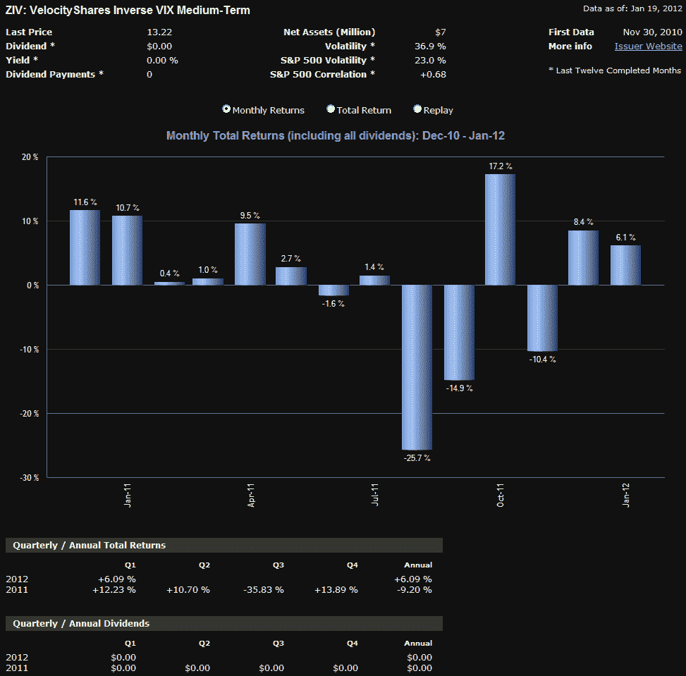

<!--yml

category: 未分类

date: 2024-05-18 16:42:47

-->

# VIX and More: ZIV 毫无理由地被忽视了

> 来源：[`vixandmore.blogspot.com/2012/01/ziv-undeservedly-neglected.html#0001-01-01`](http://vixandmore.blogspot.com/2012/01/ziv-undeservedly-neglected.html#0001-01-01)

令我惊讶的是，下周将是第一个两款[VIX ETN](http://vixandmore.blogspot.com/search/label/VIX%20ETN)推出的三周年纪念日：标普 500 VIX 短期期货 ETN ([VXX](http://vixandmore.blogspot.com/search/label/VXX))和标普 500 VIX 中期期货 ETN ([VXZ](http://vixandmore.blogspot.com/search/label/VXZ))。

一些人可能还记得投资者们对这些 ETN 产品持消极态度的开始（见[基于波动率的 ETP 资产图表](http://vixandmore.blogspot.com/2011/01/charting-assets-of-volatility-based.html)），但这两款产品现在是非常成功的波动率 ETP 领域的头两名，分别拥有 7 亿美元和 1.88 亿美元的资产。

众所周知，VXX 一直是短期交易者的宠儿，而 VXZ 有时难以吸引广泛的受众。随着投资者对[VIX 期货](http://vixandmore.blogspot.com/search/label/VIX%20futures)的影响及由此产生的[滚动收益](http://vixandmore.blogspot.com/search/label/roll%20yield)的了解加深，相对于 VXX，对 VXZ 的兴趣有所增加，但是后者，以其五个月的目标到期日，仍然在短期目标（一个月到期日）的姐妹产品的陪衬下处于次要地位。

我很好奇在 2010 年 11 月 VelocityShares 推出两款与 VXX 和 VXZ 本质上相反的产品时，这种动态是如何演变的。再次，短期产品迅速吸引了大部分交易者的兴趣，因为[XIV](http://vixandmore.blogspot.com/search/label/XIV)很快确立了自己在 VIX ETP 领域的第二名地位。尽管对 XIV 的喜爱当然可以理解，由于 VIX 期货持续的[正向延期](http://vixandmore.blogspot.com/search/label/contango)和负向[滚动收益](http://vixandmore.blogspot.com/search/label/roll%20yield)的历史，但是当[欧洲主权债务危机](http://vixandmore.blogspot.com/search/label/European%20sovereign%20debt%20crisis)及其造成的创纪录的[反向延期](http://vixandmore.blogspot.com/search/label/backwardation)从 2011 年 7 月至 11 月摧毁了 75%的 ETP 价值时，该产品遭受了巨大的回撤。

在这种背景下，我对投资者对 VelocityShares 每日反向 VIX 中期 ETN（[ZIV](http://vixandmore.blogspot.com/search/label/ZIV)）所表现出的兴趣不足感到惊讶。简而言之，ZIV 具有与长 XIV 和/或空 VXX 头寸相似的许多优点，但风险要小得多。具体来说，根据 2004 年以来的 VIX 期货数据，ZIV 约 65%的时间受益于负回滚收益，负回滚的年度收益平均超过 20%。随着 XIV 受到所有关注，我想知道投资者是否意识到，自从这两种产品推出以来，XIV 下跌了而 ZIV 上涨了。

当然，就像 XIV 一样，ZIV 也暴露于 VIX 的急剧波动之中，正如下图所反映的那样。但值得注意的是，当 VIX 急剧上涨时，可以预期 ZIV 的价值下跌速度大约是 XIV 损失速度的一半。例如，当 XIV 下跌了 75%时，ZIV 下跌了 42%。需要重申的是，反向波动性产品的一个关键特征是，即使长期前景光明，短期大幅损失的可能性也很大。

最后，对于那些投资于或交易基于 VIX 的 ETP 的人来说，重要的是要记住，短期回报很可能是 VIX 和 VIX 期货变化的结果，而长期回报将主要受到 VIX 期货期限结构的影响。

相关帖子：

**

*[来源：ETFreplay.com]*

****[披露：]** *在撰写时持有 XIV 和 ZIV 的多头头寸，持有 VXX 的空头头寸**
