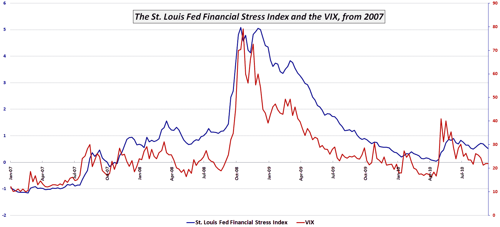

<!--yml

category: 未分类

date: 2024-05-18 17:02:22

-->

# VIX and More: 聚焦圣路易斯联邦储备银行金融压力指数

> 来源：[`vixandmore.blogspot.com/2010/09/zooming-in-on-st-louis-feds-financial.html#0001-01-01`](http://vixandmore.blogspot.com/2010/09/zooming-in-on-st-louis-feds-financial.html#0001-01-01)

昨天的帖子，[圣路易斯联邦储备银行金融压力指数](http://vixandmore.blogspot.com/2010/09/st-louis-feds-financial-stress-index.html)，引起了人们极大的兴趣，我喜欢称之为[STLFSI](http://vixandmore.blogspot.com/search/label/STLSFI)。

不足为奇，许多问题和评论都涉及 2008 年金融危机期间以及至今 STLFSI 和 VIX 的表现。

下面的图表放大了之前的 1993-2010 时间轴，并突出显示了自 2007 年初以来的 STLFSI 和 VIX。请记住，数据是每周更新的（STLFSI 每周只更新一次），因此一些细微差别被忽略了。尽管如此，一些结论是不可避免的。例如，STLFSI 似乎比 VIX 更好地标志了从 2007 年底到 2008 年 9 月经济形势恶化的情况。此外，STLFSI 表明，2008 年底系统中的极端压力比 VIX 所让投资者相信的要长久。最后 - 也许与当前情况最相关的是 - VIX 几乎完全折扣了四个月后的 2010 年 5 月波动高峰，而 STLFSI 表明，2010 年 5 月的事件，由[欧洲主权债务危机](http://vixandmore.blogspot.com/search/label/European%20sovereign%20debt%20crisis)突显，仍然在市场当前状态上投下了阴影。

正如经常发生的那样，这里的整体分析方法胜过了单一指标。

相关帖子：

*

*[来源: 圣路易斯联邦储备银行]*

****披露：*** *无*
