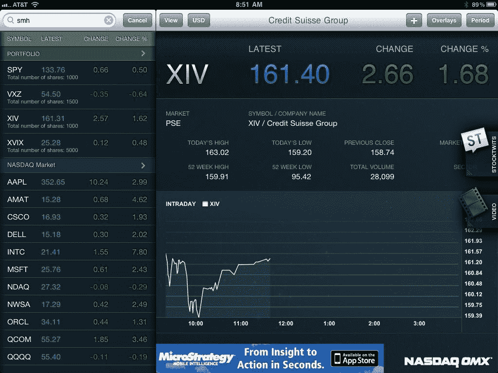

<!--yml

分类：未分类

日期：2024-05-18 16:51:21

-->

# VIX and More: iPad 金融市场应用之 FOX、汤森路透和纳斯达克 OMX

> 来源：[`vixandmore.blogspot.com/2011/04/ipad-financial-markets-apps-from-fox.html#0001-01-01`](http://vixandmore.blogspot.com/2011/04/ipad-financial-markets-apps-from-fox.html#0001-01-01)

在为[iPad](http://vixandmore.blogspot.com/search/label/iPad)审查基于金融市场的新闻和数据应用时，我首先从免费应用开始，其中包括高质量的应用[CNBC Real-Time for the iPad](http://vixandmore.blogspot.com/2011/04/cnbc-real-time-for-ipad.html)和亚军[Bloomberg for iPad](http://itunes.apple.com/us/app/bloomberg-for-ipad/id364304764?mt=8)——这两款我都本月早些时候进行了评测。

第二层次（或许这种描述有些过于严厉）的免费应用，在我实验过的同一广泛的金融市场领域中，包括来自 FOX 的一个应用，来自汤森路透的两个应用以及纳斯达克 OMX 的一个更专业的应用。

这些接近成功的应用中，我最喜欢的是[FOX Business for iPad](http://itunes.apple.com/us/app/fox-business-for-ipad/id384159739?mt=8)，它与 CNBC 和彭博应用类似，因为它的重点是新闻、视频内容和市场数据。该网站组织得很有吸引力，有大量最新的视频内容，包括一个投资组合跟踪功能和 FOX Business Minute 按钮，用户可以快速浏览当天的头条新闻并链接到相关视频。总之，功能丰富的 FOX 应用是 CNBC 和彭博的强劲竞争对手，一些用户可能会更喜欢它胜过这两个主要竞争对手。最后，我把它算作接近成功的应用，因为它存在一些内容组织和图形问题。我还失望地发现，FOX Business for iPad 在其数据库中没有[XIV](http://vixandmore.blogspot.com/search/label/TVIX) ETF，因此我无法将其添加到我的投资组合中。

Thomson Reuters 的两款产品给我留下的印象是稍微偏向新闻和文本一些，这不太符合我的口味。在我眼里，这两款产品中我最喜欢的是[Reuters News Pro for iPad](http://itunes.apple.com/us/app/reuters-news-pro-for-ipad/id363274833?mt=8)，它在全球金融和非金融新闻方面有着很强的关注度。与竞争对手相比，它更加重视全球市场和货币。尽管这款应用缺乏正式的投资组合管理功能，但它确实拥有一个吸引人的投资组合监控模块“股票(Stocks)”，这使得跟踪各种持有资产的新闻和表现变得容易，同时还附有图表。对于国际投资者来说，我确实认为 News Pro 可能会补充或有时甚至胜过更加关注美国的 CNBC、Bloomberg 和 FOX 的应用。我还是不太确定[Thomson Reuters Marketboard](http://itunes.apple.com/us/app/thomson-reuters-marketboard/id363999272?mt=8)应用的目标受众是谁，尽管看起来这个应用试图利用和扩展 Thomson ONE 账户持有者的可用功能和数据。在某些方面，这个应用似乎是 News Pro 的一个潜在伴侣。同样，内容中有着强大的全球数据，但重点更多地是标题和快照，而非详细内容。如果你对研究、公司报告和企业活动感兴趣——特别是如果你已经是 Thomson ONE 的订阅者——Marketboard 应该会很有吸引力。

在我想要对这一组应用感到兴奋的所有应用中，名列前茅的是[QFolio HD – the NASDAQ OMX Portfolio Manager](http://itunes.apple.com/us/app/qfolio-hd-nasdaq-omx-portfolio/id364265462?mt=8)。虽然来自个别券商的应用程序对于跟踪特定券商的持有资产很好用，但我尚未找到一个能够巧妙地汇总多个券商和资产类别投资组合信息的功能。不幸的是，QFolio 没有达到我的期望，尽管它并没有缺乏尝试。

QFolio 有三个主要屏幕：投资组合；公司详情；以及市场思维。投资组合屏幕包括聚合的投资组合信息以及总投资组合价值。我对于概览屏幕只有一个屏幕能显示四个持仓感到失望。虽然滚动可以快速访问完整的持仓列表，但一个屏幕上显示更多持仓和更少信息会更好，理想情况下用户可以自定义此信息。下面的截图*[带有虚构的投资组合数据 - 编辑]* 是公司详情数据展示的快照，其中包括到 StockTwits 饲料以及 StockTwits TV 视频饲料的链接。最后但并非最不重要的是市场思维功能，这实际上是同时监控五个或更多持仓价格变化的最佳方式。在这里，您可以监控价格、查看日内图表，甚至查看时间和销售数据。尽管当前 QFolio 的版本确实是一个足够好的投资组合管理工具，但它有更大的潜力。我期待看到这个应用程序随时间如何演变。

相关文章：

*[图片：QFolio/纳斯达克 OMX]*

---------------------------------------- 披露：*写作时 XIV 很长*
