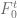
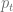
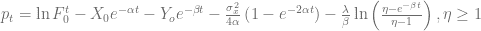
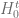
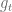
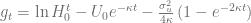
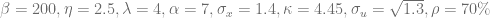

<!--yml

category: 未分类

date: 2024-05-13 00:14:43

-->

# VPP 定价 I：随机过程与偏积分微分方程 – HPC-QuantLib

> 来源：[`hpcquantlib.wordpress.com/2011/06/13/vpp-pricing-i-stochastic-processes-partial-integro-differential-equation/#0001-01-01`](https://hpcquantlib.wordpress.com/2011/06/13/vpp-pricing-i-stochastic-processes-partial-integro-differential-equation/#0001-01-01)

虚拟电厂（VPP）定价算法的基础是电价和天然气价格的联合随机过程。而不是直接为火花价差定义随机微分方程，然后火花价差由电价和天然气价格与 VPP 加热速率的差值给出。

Kluge 模型将用于定义电价过程[1]，指数 Ornstein-Uhlenbeck 将描述天然气价格[2]。

其中是具有跳跃强度的泊松过程。为了匹配电力远期曲线，季节函数由以下方式给出[1]：

为了与天然气远期曲线保持一致，季节函数由以下方式定义：

Feynman-Kac 定理可应用于推导相应的三维偏积分微分方程。

![\begin{array}{rcl} rV&=&\frac{\partial V}{\partial t}+\frac{\sigma_x²}{2}\frac{\partial² V}{\partial x²}-\alpha x\frac{\partial V}{\partial x}-\beta y \frac{\partial V}{\partial y} \\[6pt]&+&\frac{\sigma_u²}{2}\frac{\partial² V}{\partial u²}- \kappa u\frac{\partial V}{\partial u} +\rho\sigma_x\sigma_u\frac{\partial² V}{\partial x\partial u}\\[6pt] &+&\lambda\int_\mathbb{R}\left(V(x,y+z,u,t)-V(x,y,u,t) \right )\omega(z)dz \\ \end{array}](img/7f253ce1b580c8eb2d310af36b53214c.png)

In general at least one further dimension is needed to keep track of the state of the virtual power plant. Therefore solving this model using finite difference methods will lead to a four-dimensional PIDE problem.

以下图表显示了基于免费提供的[Kyos 示例远期曲线](http://www.kyos.com/?content=65)的电力和天然气价格的一年路径示例。 样本参数化受到[1]影响电力过程和[2]影响天然气过程。

代码可在[这里](http://hpc-quantlib.de/src/vpp1.zip)获得。 它依赖于最新的[QuantLib](http://www.quantlib.org/)版本，来自[SVN trunk](http://sourceforge.net/p/quantlib/code/HEAD/tree/)。 如果您想直接从 C ++程序生成图表，还需要[R](http://www.r-project.org/)，[RCPP](http://cran.r-project.org/web/packages/Rcpp/index.html)和[RInside](http://cran.r-project.org/web/packages/RInside/index.html)。

[1] T. Kluge，[定价摆动期权和其他电力衍生品](http://eprints.maths.ox.ac.uk/246/1/kluge.pdf)

[2] G. Fusai，A. Roncoroni，[在量化金融中实施模型：模型和案例](http://www45.essec.edu/professorsCV/showRef.do?bibID=364)，第十九章，ISBN：978-3-540-22348-1
