<!--yml

类别：未分类

日期：2024 年 05 月 13 日 00:16:08

-->

# 虚拟电厂定价 II：混合整数线性规划 – HPC-QuantLib

> 来源：[`hpcquantlib.wordpress.com/2011/06/23/vpp-pricing-ii-mixed-integer-linear-programming/#0001-01-01`](https://hpcquantlib.wordpress.com/2011/06/23/vpp-pricing-ii-mixed-integer-linear-programming/#0001-01-01)

接下来的两个步骤是定义一个简单的虚拟电厂（或简化的燃气发电厂）合同，并设置混合整数线性规划优化（MIP）来计算内在价值和基于蒙特卡罗模拟并假设*完美预见*的外在价值的上限。下一部分中概述的第三步将是使用动态规划和有限差分方法“精确”定价外在价值。

简化燃气发电厂的设置类似于教材 [1] 第 4.2.3 章节中解释的设置。一般来说，发电厂有三个功率输出级别：

+   发电厂关闭时，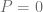

+   发电在最小负荷时 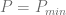

+   发电在最大负荷时 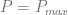

发电厂有固定的效率率

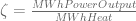。

斜坡率将被忽略，但发电厂有最小正常运行时间 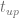 和最小停机时间 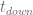。启动成本由固定启动成本 （以欧元计）和产生启动热量所需的天然气价格 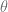（以 MWh 计）给出。

混合整数线性优化每小时运行一个小时的时间，并且每小时使用三个决策变量 。二进制决策变量 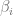 如果发电厂运行在最小负荷 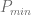 或者最大负荷 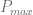 时为真，且  在发电厂关闭时为假。实际决策变量 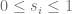 在小时  启动发电厂时为 1，这由以下约束隐含

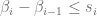。

最小正常运行时间  和最小停机时间  是约束的结果

![\begin{array}{rcl} \beta_i &\ge& \sum_{t=i-t_{up}+1}^{t=i} s_t \\[7pt] \beta_i &\le& 1-\sum_{t=i+1}^{t=i+t_{down}} s_t \end{array}](img/6c9ce869fd21ff4f135816f050204369.png)

实际决策变量 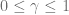 等于 1，如果发电厂以最大负载  运行，等于 0，如果发电厂以最小负载  运行或者发电厂关闭，即

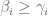

让 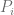 为电力价格，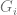 为天然气价格，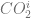 为第  小时的二氧化碳价格。然后，目标函数由以下给出

![P\& L = \sum_{t=1}^N\left[\left(\gamma_iP_{max} + P_{min}(\beta_i-\gamma_i)\right) \left(P_i - \frac{G_i+CO_2^i}{\zeta}\right) - s_i\left(\eta + \theta (G_i+CO_2^i)\right)\right]](img/a23fead6eabe08004bb479b6923100fd.png)

对于一年的时间跨度，问题包含 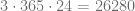 决策变量 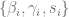 和  约束。这个相对较小的问题可以使用例如 [Gnu Linear Programming Kit](http://www.gnu.org/software/glpk/) (GLPK) 来解决。有关开源线性/混合整数规划求解器的概述，请参见 [2]。

模型参数和示例前向曲线在前一篇文章 [VPP Pricing I](https://hpcquantlib.wordpress.com/2011/06/13/vpp-pricing-i-stochastic-processes-partial-integro-differential-equation/) 中已经概述。下面的图表显示了基于 Monte-Carlo、完全预见和 MIP 对不同功率发电厂效率 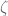 的内在价值和总价值（内在价值加外在价值）的上限。VPP 合同的参数如下

,

（固定的）二氧化碳价格为每 MWh 热量 3.0 欧元。  

源代码可在 [这里](http://hpc-quantlib.de/src/vpp2.zip) 获取。它依赖于 [GLPK](http://www.gnu.org/software/glpk) 和来自 [SVN trunk](http://sourceforge.net/p/quantlib/code/HEAD/tree/) 或下一个 QuantLib 1.2 发行版的最新版本 [QuantLib](http://www.quantlib.org/)。

现在添加和定价时间积分约束变得非常容易，例如以下约束限制了一年内启动次数不超过给定数量。

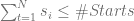。

以下图表展示了当  且最小负载为 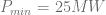 时的结果。

源代码在[这里](http://hpc-quantlib.de/src/vpp3.zip)可获得。它依赖于 QuantLib 1.1，如果你想直接从 C++ 程序生成图表，你还需要[R](http://www.r-project.org/)，[RCPP](http://cran.r-project.org/web/packages/Rcpp/index.html)和[RInside](http://cran.r-project.org/web/packages/RInside/index.html)。

[1] M. Burger，B. Graeber，G. Schindlmayr，Managing Energy Risk，ISDN 978-0-470-ß2962-6

[2] S. R. Thorncraft，[评估开源 LP 优化代码解决电力现货市场优化问题。](http://www.ceem.unsw.edu.au/content/userDocs/stu-ORMMES06_Benchmarking_20060610_FINAL_CEEM.pdf)
