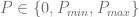
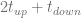
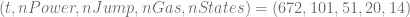

<!--yml

类别：未分类

日期：2024-05-17 23:39:37

-->

# VPP 定价 III：基于有限差分方法的精确定价 – HPC-QuantLib

> 来源：[`hpcquantlib.wordpress.com/2011/08/07/vpp-pricing-iii-exact-pricing-based-on-finite-difference-methods/#0001-01-01`](https://hpcquantlib.wordpress.com/2011/08/07/vpp-pricing-iii-exact-pricing-based-on-finite-difference-methods/#0001-01-01)

虚拟发电厂（VPP）的总价值可以分解为内在部分和外在部分。内在价值由 VPP 基于当前电力和天然气远期曲线产生的现金流组成。因此，可以使用线性或动态优化方法计算内在价值，而不需要为电力和天然气价格定义随机模型。计算外在价值意味着精确定价以计算给定随机过程的总价值。此处使用的模型在文章 VPP 定价 I：随机过程与偏积分微分方程。中概述。可以使用最小二乘蒙特卡罗或有限差分方法使用动态规划进行局部优化[1]来进行精确定价。

焦点是有限差分法，它涉及解决三维偏积分微分方程

![\begin{array}{rcl} rV&=&\frac{\partial V}{\partial t}+\frac{\sigma_x²}{2}\frac{\partial² V}{\partial x²}-\alpha x\frac{\partial V}{\partial x}-\beta y \frac{\partial V}{\partial y} \\[6pt]&+&\frac{\sigma_u²}{2}\frac{\partial² V}{\partial u²}- \kappa u\frac{\partial V}{\partial u} +\rho\sigma_x\sigma_u\frac{\partial² V}{\partial x\partial u}\\[6pt] &+&\lambda\int_\mathbb{R}\left(V(x,y+z,u,t)-V(x,y,u,t) \right )\omega(z)dz \\ \end{array}](img/7f253ce1b580c8eb2d310af36b53214c.png)

需要额外的第四维来跟踪 VPP 的不同状态。基于文章 VPP 定价 II：混合整数线性规划中概述的 VPP 类型的特征，具有三种可能负载水平的 VPP  具有  不同状态。

通过蒙特卡罗和*完美预见*进行定价涉及模拟随机过程

并且分别针对每条路径优化电厂负荷时间表，方式与计算固有价值相同。该过程将导致 VPP 的确切价格的上限。根据这两种方法和 VPP 定价 II 中概述的参数，基于 4 周 VPP 合同的价格几乎没有差异，除了蒙特卡洛误差（参见下图，与[1]对比）。

有限差分法的栅格大小为

。

该代码可在[这里](http://hpc-quantlib.de/src/vpp4.zip)获取。它依赖于最新的[QuantLib](http://www.quantlib.org/)版本来自[SVN trunk](http://sourceforge.net/p/quantlib/code/HEAD/tree/)或即将发布的 QuantLib 1.2 版本。如果要生成绘图，您还需要[R](http://www.r-project.org/)。

[1] H. van Dijken,  D. van Abbena, H.S. Los, C. de Jong, [启动电厂的价值。](http://www.erasmusenergy.com/articles/192/1/The-value-of-starting-up-the-power-plant/Page1.html)
