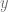
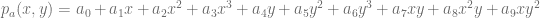

<!--yml

类别：未分类

日期：2024-05-17 23:38:59

-->

# VPP 定价 V：最小二乘蒙特卡罗 - HPC-QuantLib

> 来源：[`hpcquantlib.wordpress.com/2011/11/05/vpp-pricing-v-least-squares-monte-carlo/#0001-01-01`](https://hpcquantlib.wordpress.com/2011/11/05/vpp-pricing-v-least-squares-monte-carlo/#0001-01-01)

为了完整起见，请在[这里](http://www.hpc-quantlib.de/src/vpp6.zip)找到使用最小二乘蒙特卡罗算法评估虚拟电厂（VPP）的代码。 该代码依赖于来自[QuantLib](http://quantlib.org)的最新版本的[SVN trunk](http://sourceforge.net/p/quantlib/code/HEAD/tree/)或即将发布的 QuantLib 1.2 版本。 模型和电厂规格可以在先前的博客条目中找到。 问题和算法的更一般描述可以在[这里](http://www.hpcquantlib.wordpress.com/2011/11/05/vpp-pricing-v-least-squares-monte-carlo/#0001-01-01)找到。 测试远期曲线可以从[Kyos 示例下载页面](http://www.kyos.com/?content=65)获取。

回归多项式对火花传播  和天然气价格  的随机成分采用三阶。

对每个运动（每小时）和每个可能的 VPP 状态单独进行回归。 校准阶段基于普通蒙特卡罗场景，而定价是使用准蒙特卡罗场景（Sobol 序列）和布朗桥（BB）完成的。

以下表格总结了不同定价算法在六个月期限的示例合同的性能。 目标精度约为净现值相对误差的 1％。 定时是使用四个线程的 Core i5 @ 3GHz CPU 或具有 336 个核心的 GTX560 @ 0.8 / 1.6GHz GPU 给出的。

![\footnotesize{  \begin{tabular}{|c|c|c|c|c|c|} \hline Algorithm & Optimisaton & Approximation & Hardware & Runtime & Comment\\ \hline \hline Quasi-MC + BB & dyn. prog. & perfect foresight & GPU & 0.19s & single precision \\ Quasi-MC + BB & dyn. prog. & perfect foresight & CPU & 20.3s & \\ Monte-Carlo & dyn. prog. & perfect foresight & CPU & 286.3s & \\ Finite Difference & dyn. prog.& no & CPU & 487.7s & \\ Least-Squares MC & dyn. prog. & no & CPU & 645.6s & \\ Quasi-MC + BB & linear prog. & perfect foresight & CPU & 4198s & using GLPK \\ \hline \end{tabular} } ]

我不知道[Gnu 线性规划套件](http://www.gnu.org/s/glpk/)在这类问题上性能不佳的原因。 一些商业线性优化器速度要快得多，但它们无法与动态规划竞争，对于简单的 VPP 来说，动态规划可能是最佳选择。 一旦涉及例如时间积分约束，线性规划可能成为首选方法。

[1] H. van Dijken，[启动电厂的价值。](http://www.erasmusenergy.com/articles/192/1/The-value-of-starting-up-the-power-plant/Page1.html)
