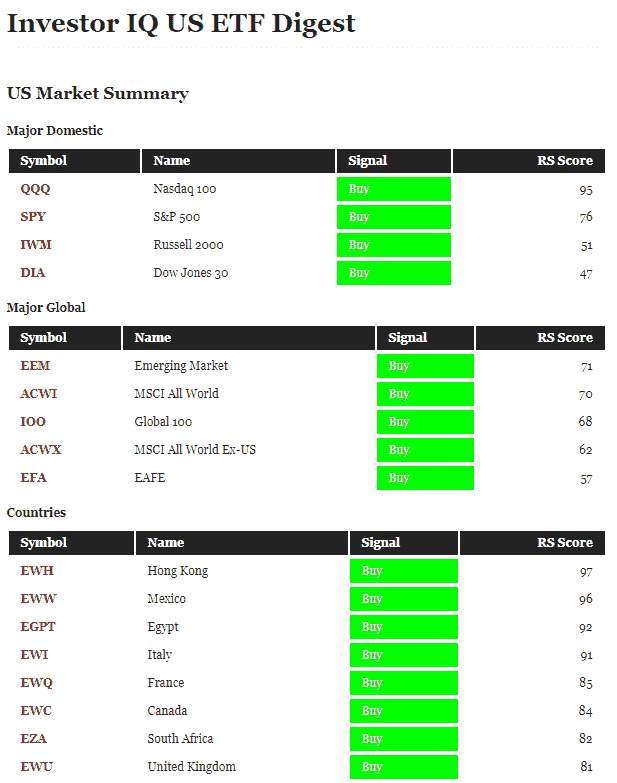

<!--yml

category: 未分类

date: 2024-05-12 17:43:34

-->

# 欢迎来到投资者 IQ | 中国学生学者联谊会

> 来源：[`cssanalytics.wordpress.com/2019/05/13/welcome-to-investor-iq/#0001-01-01`](https://cssanalytics.wordpress.com/2019/05/13/welcome-to-investor-iq/#0001-01-01)

在 CSSA 博客上有一些有趣的新内容，这对读者非常有用。投资者 IQ 目前是一个免费工具，展示了一系列美国和加拿大 ETF 的基本趋势信号（买入、持有或卖出），以及相对强度排名。这些信号将在周五收盘后更新，并在周一上午发布。此功能目前处于测试阶段，并将扩展到包括个股和其他分析内容。它可以在博客的 [“CSSA”](https://cssanalytics.wordpress.com/about/) 标签下作为下拉菜单找到。下面是部分输出的示例。更多详细信息将随后发布……

