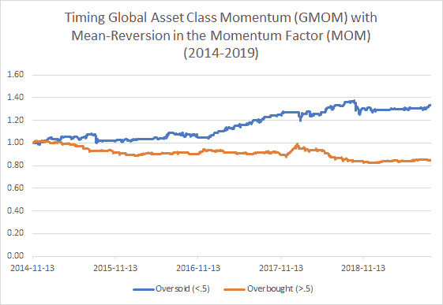

<!--yml

category: 未分类

date: 2024-05-12 17:40:55

-->

# 何时购买动量？动量因子中的均值回归 | CSSA

> 来源：[`cssanalytics.wordpress.com/2019/09/12/when-should-you-buy-momentum-mean-reversion-in-the-momentum-factor/#0001-01-01`](https://cssanalytics.wordpress.com/2019/09/12/when-should-you-buy-momentum-mean-reversion-in-the-momentum-factor/#0001-01-01)

最近，[Bespoke Research](https://www.bespokepremium.com/interactive/posts/think-big-blog/momentum-massacre)发布了一篇很好的文章，重点突出了我们最近在市场上目睹的“动量大屠杀”。高飞的动量股被摧毁，低动量/输掉的股票却大获全胜。跟踪动量因子的最佳方式之一是查看 ETF 代码：[MOM 或 QuantShares 美国市场中性动量基金](https://www.agf.com/us/products/mom/index.jsp)。正如下图所示，过去 10 天动量因子急速下跌，完全逆转了年初的总回报。

这引出了一个显而易见的问题：我们可以期待未来表现的一些均值回归吗？作为一个简单的测试，我看了看 MOM 的 10 天回报，并使用 5 天平均值平滑了它们，以解决对于流动性较差的 ETF 的收盘价格中的一些噪音。然后，我观察了在每个时间点上所有可用数据的平滑 10 天回报的累积百分位排名。我发现，在过去的 8 年（最大数据可用期间），动量因子一直高度均值回归。如果你在平滑的 10 天回报超过中位数（.5）之后购买动量因子，你会持续亏钱。相比之下，如果你在回报低于中位数时购买，则会持续盈利。显然，均值回归一直是推动绩效的一个强大因素，你可以在下图中看到：

要了解这对追踪高动量股票的投资者有何益处，我研究了如何使用相同的均值回归振荡器来确定[MOM 或 iShares MSCI 美国动量因子](https://www.ishares.com/us/products/251614/ishares-msci-usa-momentum-factor-etf)的时间。在下图中，我们看到使用这个振荡器已经成为一种非常有用的方式来确定是持有还是退出高动量股票：

当动量因子被超卖时（<0.5），年化收益率几乎达到了 17%，夏普比为 1.74；相反，当动量因子被超买时——几乎有 50%的时间——你会亏钱。一个显而易见的问题是动量方法中是否存在某种偏差，使其不太适用于更集中的方法。为了解决这个问题，我测试了在[QMOM 或 Alpha Architect 的美国定量动量 ETF](https://etfsite.alphaarchitect.com/qmom/)上使用振荡器。虽然历史数据较短，但总体结论是相同的：动量因子的均值回归是一种很好的时间选择动量股票的方法：

最后，也许最有趣的测试是股票动量因子是否可以用于定时资产类动量。我以前读过的研究表明，动量因子与资产类动量相关。如果是这样的话，我们可以期望振荡器应该能够有效地定时全球资产配置。为了测试这一点，我使用了[GMOM 或 Cambria 的全球动量 ETF](https://www.cambriafunds.com/gmom)。下面的图表讲述了以下故事：

显然，均值回归已经对使用动量方法的全球资产配置的时间选择产生了影响。令人惊讶的是它的效果有多么显著。拥有更多数据，使用代理策略来测试这些假设的假设在更大样本量上会很有价值，但我目前没有每日追溯到很久以前的数据。尽管如此，尊重当前市场趋势及其对投资策略的影响仍然非常重要。近年来，动量因子中的均值回归效应是绩效的一个非常真实和实质性的驱动因素。

为什么动量因子中会存在均值回归效应？我认为很多统计套利资金追逐动量因子，为了能够重新平衡以保持风险限制并解除头寸，他们需要在盈利时卖出并在亏损时买入。要做到这一点，需要有大量零售和其他机构资金追逐或逃离动量，以提供给他们流动性。也许这种“聪明资金”的影响解释了为什么动量具有均值回归性。无论哪种情况，试图解释这种现象都需要进行非常深思熟虑和深入分析，形成一篇严肃的研究论文。
