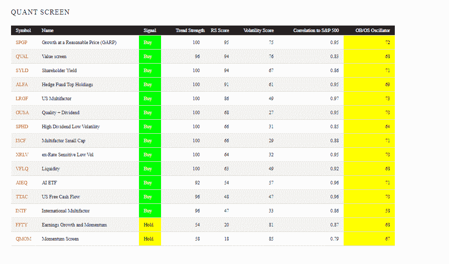

<!--yml

类别：未分类

日期：2024-05-12 17:37:40

-->

# 哪些量化交易 ETF 表现最佳？| CSSA

> 来源：[`cssanalytics.wordpress.com/2019/11/18/which-quant-etfs-are-outperforming/#0001-01-01`](https://cssanalytics.wordpress.com/2019/11/18/which-quant-etfs-are-outperforming/#0001-01-01)

投资于当今环境的挑战之一是有太多的投资产品，很难跟踪。我们最近推出的网站 Investor IQ 旨在帮助更好地组织投资者，并为他们提供所需的分析，以做出更好的决策。追求绩效的最大风险在于，如果您没有掌握现在发生的情况，而是追逐过去 3 年或 5 年的获胜基金（这些基金很可能会回归均值）。我们的相对强度评级跟踪短期间隔内的动量，以更好地捕捉未来的超额表现。以下是我们“量化交易 ETF”类别下的当前快照，美国 ETF 摘要使您可以轻松查看哪些量化风格目前表现最佳：

正如您所见，市场目前青睐的股票要么是被低估的（价值筛选/QVAL 和股东收益/SYD），要么是以合理的价格表现增长（GARP），这些股票在相对强度或“RS Score”排名中位居前列。这反映出市场明显从成长（FFTY）和动量（QMOM）股票转移，后者排名垫底。事实上，信号——这是一组趋势和动量信号的集合——显示它们的趋势处于谨慎或“持有”位置，而所有其他因素仍处于“买入”信号状态。右侧的 OB/OS 振荡器是一组均值回归指标，范围从 0 到 100（从最少到最多超买）。目前列表中的所有 ETF 在时间上都是中性的，但接近超买区域（>80），此时应避免新购买或减少现有仓位。

这份列表的目标是捕捉量化交易者在长仓格式中与广义指数相比产生超额收益的许多因素。我们有意忽略那些能够筹集现金的策略，因为我认为那是一种独立的战术策略流派。如果您有建议，提供一些不与当前列表成员重复的额外量化交易 ETF，欢迎在评论区留言，我将在审核后尽快添加。
