<!--yml

类别：未分类

日期：2024-05-18 13:43:45

-->

# 为什么要使用对数收益率 | Quantivity

> 来源：[`quantivity.wordpress.com/2011/02/21/why-log-returns/#0001-01-01`](https://quantivity.wordpress.com/2011/02/21/why-log-returns/#0001-01-01)

最近有读者提出了一个重要问题，这个问题经常让那些新接触量化金融的人感到困惑（尤其是那些从[技术分析](http://en.wikipedia.org/wiki/Technical_analysis)转来的人，技术分析依赖于价格模式分析）：

> 为什么要使用对数收益率，而不是价格或原始收益？

答案有几个方面，每个方面的重要性因问题领域而异。

从定义一个收益开始：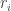 在时间 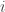，其中 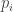 是时间  的价格，而 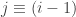：

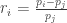

使用*returns*而不是价格的好处是*标准化*：以可比较的度量单位测量所有变量，从而使得尽管来自不同价值的价格序列，但仍能够评估两个或多个变量之间的分析关系。这是许多多维统计分析和机器学习技术的要求。例如，当变量都以百分比来衡量时，解释股票的[协方差矩阵](http://en.wikipedia.org/wiki/Covariance)是合理的。

使用*log returns*的几个好处，无论是理论上的还是算法上的。

首先，*对数正态性*：如果我们*假设*价格以[对数正态分布](http://en.wikipedia.org/wiki/Log-normal_distribution)分布（实际上，对于任何给定的价格序列可能是真实的也可能是不真实的），那么 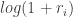 很方便地是[正态分布](http://en.wikipedia.org/wiki/Normal_distribution)，因为：

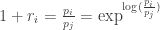

在许多经典统计学中，这非常方便地假设正态性。

第二，*近似原始对数相等性*：当收益非常小（对于持有时间较短的交易而言很常见）时，以下近似确保它们与原始收益的值接近：

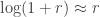 , 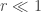

第三，*时间可加性*：考虑一个有序的  个交易序列。从这个序列中经常计算的一个统计量是*复合收益*，它是这个交易序列随时间的运行收益：

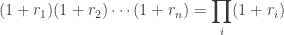

这个公式相当让人不快，因为概率论提醒我们，正态分布变量的乘积*不是正态分布*。相反，正态分布变量的和是正态分布（重要的技术细节：只有当所有变量*不相关*时），当我们回想起以下对数恒等式时，这是有用的：

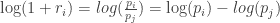

因此，复合收益是正态分布的。最后，这个恒等式给我们带来了一个愉快的算法优势；一个简单的公式来计算复合收益：

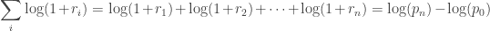

因此，*n*期的复合回报仅仅是初始和最终期间的对数差。从[算法复杂度](http://en.wikipedia.org/wiki/Big_O_notation)的角度来看，这种简化将 O(n)次乘法降低为 O(1)次加法。这对于中等到大型的*n*是一个巨大的优势。此外，这个和对于收益偏离正态分布的情况是有用的，因为[中心极限定理](http://en.wikipedia.org/wiki/Central_limit_theorem)提醒我们，这个和的样本平均值将收敛于正态分布（假设有限的一阶和二阶矩）。

第四，*数学上的便利*：从[微积分](http://en.wikipedia.org/wiki/Calculus)中，我们被提醒（忽略[积分常数](http://en.wikipedia.org/wiki/Constant_of_integration)）：

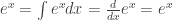

这个恒等式非常有用，因为许多金融数学是建立在[连续时间随机过程](http://en.wikipedia.org/wiki/Continuous-time_stochastic_process)之上的，这些过程严重依赖于积分和微分。

第五，*数值稳定性*：小数的加法在数值上是安全的，而小数的乘法则不然，因为它容易受到[算术下溢](http://en.wikipedia.org/wiki/Arithmetic_underflow)的影响。对于许多有趣的问题，这是一个严重的潜在问题。为了解决这个问题，算法必须被修改为数值稳健的，或者通过对数变换可以将其转化为数值安全的求和。

正如约翰·霍尔建议的，使用对数收益也有缺点。以下是要考虑的两篇最近的论文（以及它们的参考文献）：
